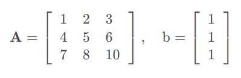
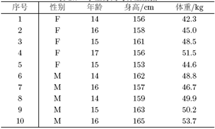

# 第 1 周　R的使用及数据获取

> 本文件由 `大数据实验1.pptx` 整理而成；
> 课件本身（.pptx）未收录进本仓库；文中的图片是幻灯片里原有的公式与数据表。

## 实验题 1

- 创建R脚本文件test0101.R，完成下面任务后把该脚本文件保存在e:/test01文件夹下。
  - 用函数rep()构造一个向量x，它由3个3，4个2，5个1组成
  - 由1,2,…16构造二个方阵，其中矩阵A按列输入，矩阵B按行输入，并计算：
    - (1)C=A+B;
    - (2)D=A.*B;
    - (3)E=AB;
    - (4)去除A的第3行，B的第3列，重新计算上面的矩阵E

## 实验题 2

- 创建R脚本文件test0102.R，完成下面任务后把该脚本文件保存在e:/test01文件夹下。
  - 函数solve()有二个作用：solve(A,b)可用于求解 线性方程组Ax=b，solve(A)可用于求矩阵的逆。设
  - 请用二种方法编程求方程组Ax=b的解。

## 实验题 3

- 创建R脚本文件test0103.R，完成下面任务后把该脚本文件保存在e:/test01文件夹下。
- 有10名学生的身高与体重数据如下表所示。

- 根据上表，完成以下操作：
  - 创建名为info的数据框
  - 将该数据框写入一个纯文本的文件中，并用read.table()读取该文件中的数据
  - 将该数据框用write.csv()写成excel能打开的文件，并测试是否成功。

## 实验题 4

- 打开R脚本文件test0104.R，完成以下操作后将该脚本文件保存在e:/test01文件夹下。
- 某校测得20名学生的四项指标: 性别、年龄、身高(cm)和体重(kg),数据存储于wh.csv中。
  - 1) 绘制体重对身高的散点图;
  - 2) 绘制不同性别下, 体重对身高的散点图;
  - 3) 绘制不同年龄阶段, 体重对身高的散点图;
  - 4) 绘制不同性别和不同年龄阶段, 体重对身高的散点图.

## 实验题 5　（箱线图）

- 创建R脚本文件test0105.R，使用boxplot函数完成下面任务后把该脚本文件保存在e:/test01文件夹下。
  - ⑴ airquality是1973年纽约空气质量数据，请不要使用函数关系绘制每个月的温度箱线图（即Temp），要求产生删除数据框中的缺失值
    - 箱子的宽度分别为1,2,3,4,5
    - 使用rainbow函数产生5个颜色填充，其中rainbow的其他参数s=0.5,alpha = 0.7
    - range设置为0.8
    - staple线的宽度设置为0.8
    - 图标题的字体大小设置为1.5

## 实验题 6

- 下载TCGA数据库中的结肠癌临床数据，并整理成表格形式(参考TCGA下载文档)
- 下载PIC儿童重症监护数据库（可选）
- 下载MIMIC-IV重症监护数据库（可选）
