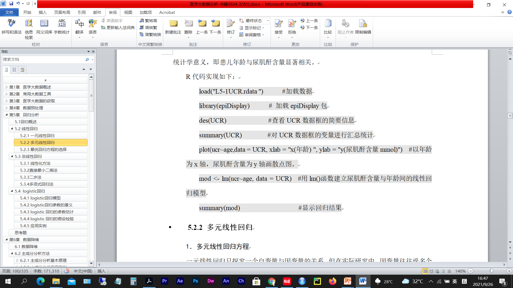
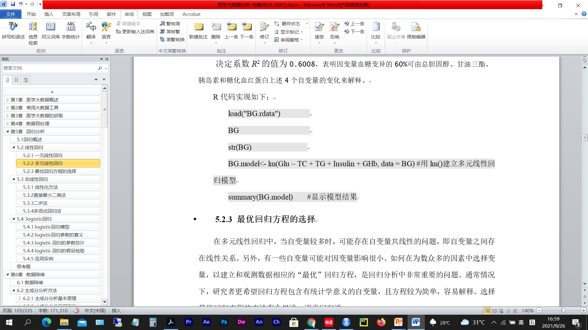
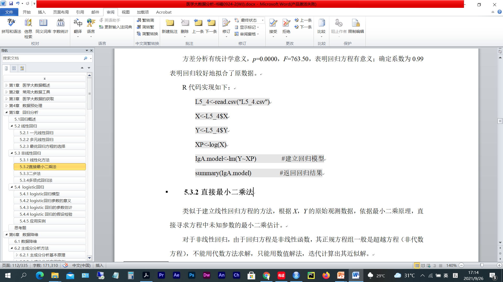
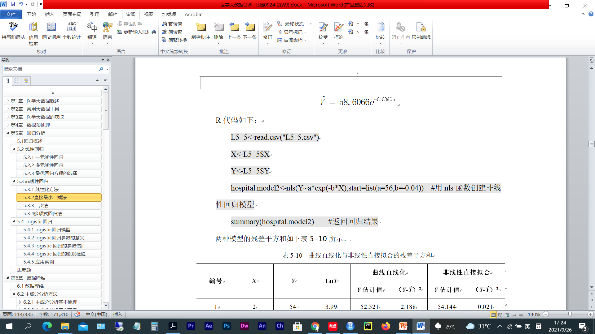
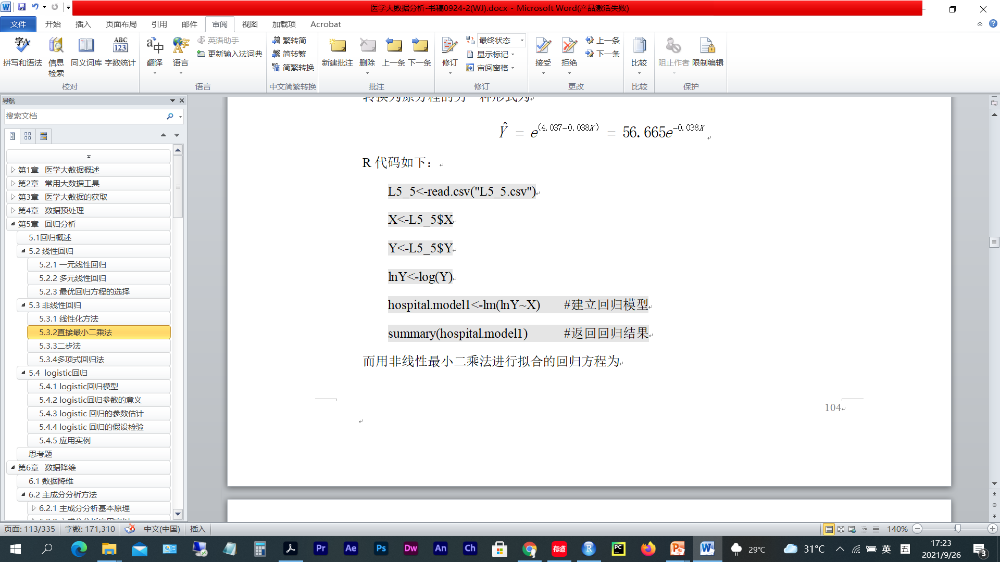
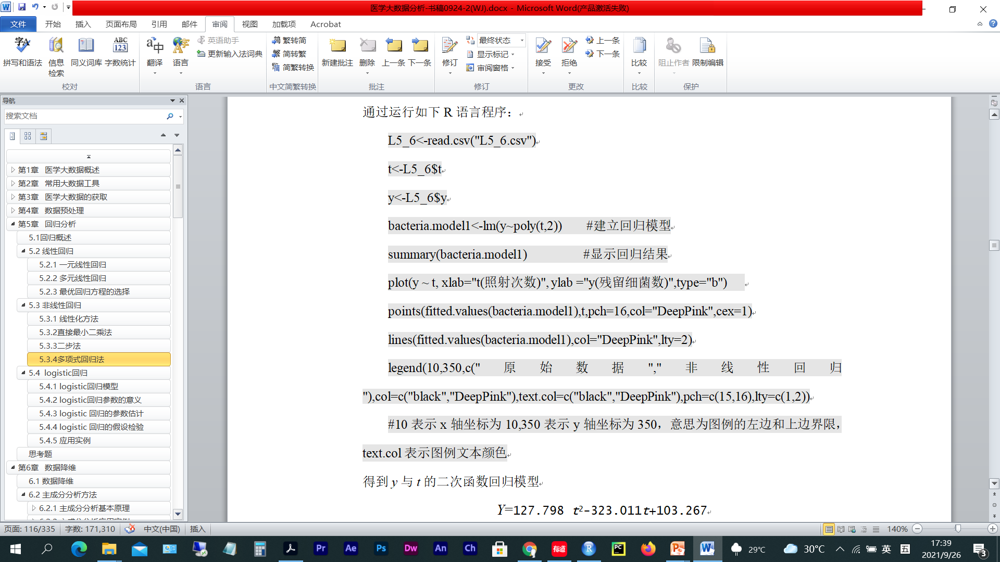
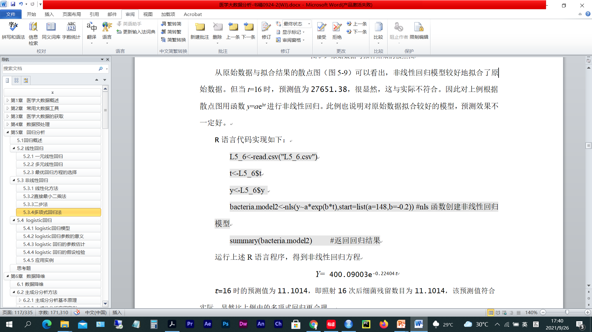
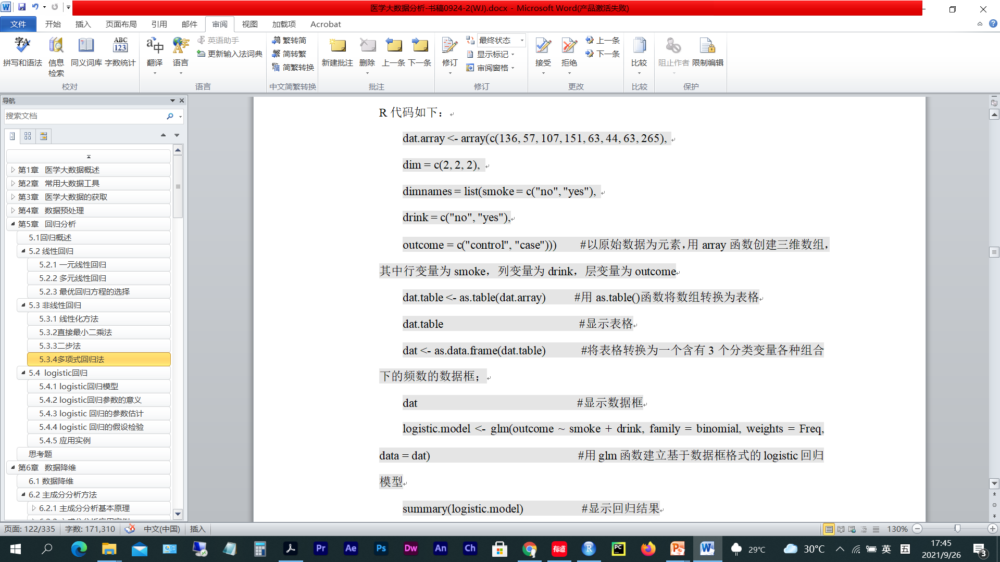

# 第 3 周　回归分析

> 本文件由 `大数据实验3.pptx` 整理而成；
> 课件本身（.pptx）未收录进本仓库；文中的图片是幻灯片里原有的公式与数据表。

## 实验题 1　一元线性回归

- 创建R脚本文件test0301.R，完成下面任务后把该脚本文件保存在e:/test03文件夹下。
  - （1）某地方病研究机构关于大骨节病患儿开展了一项调查研究，数据在L5-1UCR.rdata中，其中肌酐含量为24小时测得的尿肌酐（单位为mmol）。试建立患儿年龄与尿肌酐含量之间的线性回归模型。

## 实验题 2　多元线性回归

- 创建R脚本文件test0302.R，完成下面任务后把该脚本文件保存在e:/test03文件夹下。
  - （2）27名糖尿病人的血清总胆固醇、甘油三酯、空腹胰岛素、糖化血红蛋白、空腹血糖的测量值在L5-2BG.rdata中，试建立血糖与其他几项指标的多元线性回归方程。

## 实验题 3　最优回归方程的选择

- 创建R脚本文件test0303.R，完成下面任务后把该脚本文件保存在e:/test03文件夹下。
  - （3）对实验题2获得的因变量血糖Y与自变量总胆固醇X1、甘油三酯X2、胰岛素X3、糖化血红蛋白X4之间关系的回归方程Y=5.9433+0.1424X1+0.3515X2-0.2706X3+0.6382X4 ，进行逐步回归，获得最优回归模型。
    - 使用R语言中的drop1()函数，手动剔除变量进行逐步回归。
    - 使用step()函数逐步回归自动选择“最优”回归模型

## 实验题 4　非线性回归之线性化方法

- 创建R脚本文件test0304.R，完成下面任务后把该脚本文件保存在e:/test03文件夹下。
  - （4）某医科大学微生物学教研室以已知浓度X的免疫球蛋白A(IgA，μg/ml)作火箭电泳，测得火箭高度Y(mm) 数据见文件L5_4.csv。试拟合Y关于X的非线性回归方程。

## 实验题 5　非线性回归之最小二乘法

- 创建R脚本文件test0305.R，完成下面任务后把该脚本文件保存在e:/test03文件夹下。
  - （5）现有15名重伤病人的住院天数X与预后指标数据Y，具体见表L5_5.csv，试用线性化方法与最小二乘法分别拟合Y关于X的非线性回归方程。

## 实验题 6　非线性回归之多项式回归法

- 创建R脚本文件test0306.R，完成下面任务后把该脚本文件保存在e:/test03文件夹下。
  - （6）为了分析X射线的杀菌作用，用200千伏的X射线来照射细菌，每次照射6分钟用平板计数法估计尚存活的细菌数，照射次数记为t，照射后的细菌数为y，数据见表L5_6.csv，试求y与t的二次多项式回归模型及nls函数创建的非线性回归模型。

## 实验题 7　logistic回归

- 创建R脚本文件test0307.R，完成下面任务后把该脚本文件保存在e:/test03文件夹下。
  - （7）本例是一个研究饮酒（X1）、吸烟（X2）与食道癌（Y）关系的病例-对照资料，试作logistic回归分析。

