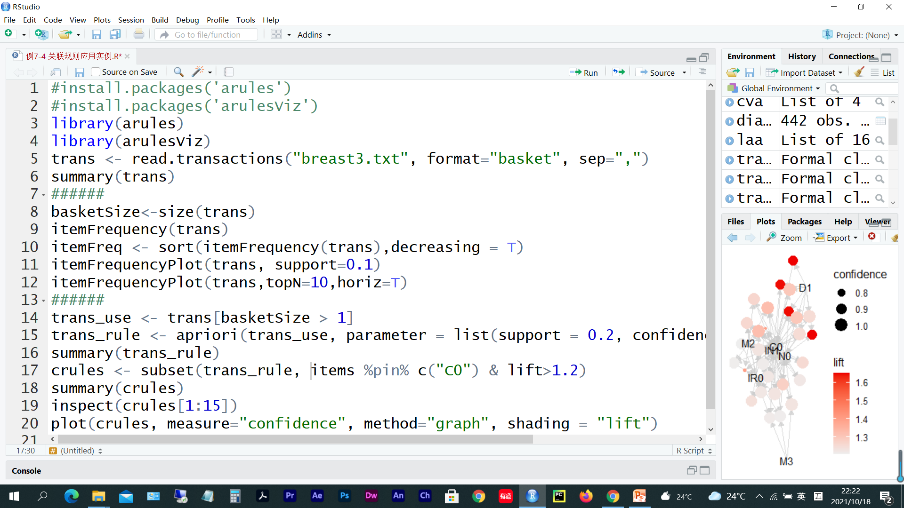
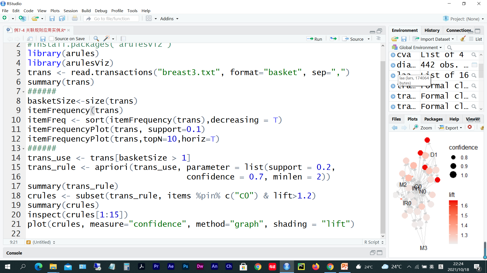

# 第 4 周　关联规则

> 本文件由 `大数据实验4.pptx` 整理而成；
> 课件本身（.pptx）未收录进本仓库；文中的图片是幻灯片里原有的公式与数据表。

## 实验题 1

- 创建R脚本文件test0401.R，完成下面任务后把该脚本文件保存在e:/test04文件夹下。
  - （1）安装并加载包“arules”与包“arulesViz”，用read.transactions( )函数读入数据文件“breast3.txt”，使用apriori函数挖掘关联规则并可视化。

- matrix
- matrix3D

## 实验题 2

- 创建R脚本文件test0402.R，完成下面任务后把该脚本文件保存在e:/test04文件夹下。
  - 参照实验1， 用R语言apriori函数挖掘下面事务数据库关联规则并可视化。

| <a:txBody><a:bodyPr/><a:lstStyle/><a:p><a:pPr algn="ctr"><a:spcAft><a:spcPts val="0"/></a:spcAft></a:pPr><a:r><a:rPr lang="zh-CN" sz="2400" kern="100" dirty="0"><a:effectLst/><a:latin typeface="Times New Roman" panose="02020603050405020304"/><a:ea typeface="宋体" panose="02010600030101010101" pitchFamily="2" charset="-122"/></a:rPr><a:t>事务 | <a:txBody><a:bodyPr/><a:lstStyle/><a:p><a:pPr algn="ctr"><a:spcAft><a:spcPts val="0"/></a:spcAft></a:pPr><a:r><a:rPr lang="zh-CN" sz="2400" kern="100"><a:effectLst/><a:latin typeface="Times New Roman" panose="02020603050405020304"/><a:ea typeface="宋体" panose="02010600030101010101" pitchFamily="2" charset="-122"/></a:rPr><a:t>项目 |
| --- | --- |
| <a:txBody><a:bodyPr/><a:lstStyle/><a:p><a:pPr algn="ctr"><a:spcAft><a:spcPts val="0"/></a:spcAft></a:pPr><a:r><a:rPr lang="en-US" sz="2400" kern="100" dirty="0"><a:effectLst/><a:latin typeface="宋体" panose="02010600030101010101" pitchFamily="2" charset="-122"/><a:ea typeface="宋体" panose="02010600030101010101" pitchFamily="2" charset="-122"/></a:rPr><a:t>T001 | <a:txBody><a:bodyPr/><a:lstStyle/><a:p><a:pPr algn="just"><a:spcAft><a:spcPts val="0"/></a:spcAft></a:pPr><a:r><a:rPr lang="en-US" sz="2400" kern="100"><a:effectLst/><a:latin typeface="宋体" panose="02010600030101010101" pitchFamily="2" charset="-122"/><a:ea typeface="宋体" panose="02010600030101010101" pitchFamily="2" charset="-122"/></a:rPr><a:t>I1，I2，I5 |
| <a:txBody><a:bodyPr/><a:lstStyle/><a:p><a:pPr algn="ctr"><a:spcAft><a:spcPts val="0"/></a:spcAft></a:pPr><a:r><a:rPr lang="en-US" sz="2400" kern="100" dirty="0"><a:effectLst/><a:latin typeface="宋体" panose="02010600030101010101" pitchFamily="2" charset="-122"/><a:ea typeface="宋体" panose="02010600030101010101" pitchFamily="2" charset="-122"/></a:rPr><a:t>T002 | <a:txBody><a:bodyPr/><a:lstStyle/><a:p><a:pPr algn="just"><a:spcAft><a:spcPts val="0"/></a:spcAft></a:pPr><a:r><a:rPr lang="en-US" sz="2400" kern="100"><a:effectLst/><a:latin typeface="宋体" panose="02010600030101010101" pitchFamily="2" charset="-122"/><a:ea typeface="宋体" panose="02010600030101010101" pitchFamily="2" charset="-122"/></a:rPr><a:t>I2，I4 |
| <a:txBody><a:bodyPr/><a:lstStyle/><a:p><a:pPr algn="ctr"><a:spcAft><a:spcPts val="0"/></a:spcAft></a:pPr><a:r><a:rPr lang="en-US" sz="2400" kern="100" dirty="0"><a:effectLst/><a:latin typeface="宋体" panose="02010600030101010101" pitchFamily="2" charset="-122"/><a:ea typeface="宋体" panose="02010600030101010101" pitchFamily="2" charset="-122"/></a:rPr><a:t>T003 | <a:txBody><a:bodyPr/><a:lstStyle/><a:p><a:pPr algn="just"><a:spcAft><a:spcPts val="0"/></a:spcAft></a:pPr><a:r><a:rPr lang="en-US" sz="2400" kern="100" dirty="0"><a:effectLst/><a:latin typeface="宋体" panose="02010600030101010101" pitchFamily="2" charset="-122"/><a:ea typeface="宋体" panose="02010600030101010101" pitchFamily="2" charset="-122"/></a:rPr><a:t>I2，I3 |
| <a:txBody><a:bodyPr/><a:lstStyle/><a:p><a:pPr algn="ctr"><a:spcAft><a:spcPts val="0"/></a:spcAft></a:pPr><a:r><a:rPr lang="en-US" sz="2400" kern="100"><a:effectLst/><a:latin typeface="宋体" panose="02010600030101010101" pitchFamily="2" charset="-122"/><a:ea typeface="宋体" panose="02010600030101010101" pitchFamily="2" charset="-122"/></a:rPr><a:t>T004 | <a:txBody><a:bodyPr/><a:lstStyle/><a:p><a:pPr algn="just"><a:spcAft><a:spcPts val="0"/></a:spcAft></a:pPr><a:r><a:rPr lang="en-US" sz="2400" kern="100" dirty="0"><a:effectLst/><a:latin typeface="宋体" panose="02010600030101010101" pitchFamily="2" charset="-122"/><a:ea typeface="宋体" panose="02010600030101010101" pitchFamily="2" charset="-122"/></a:rPr><a:t>I1，I2，I4 |
| <a:txBody><a:bodyPr/><a:lstStyle/><a:p><a:pPr algn="ctr"><a:spcAft><a:spcPts val="0"/></a:spcAft></a:pPr><a:r><a:rPr lang="en-US" sz="2400" kern="100"><a:effectLst/><a:latin typeface="宋体" panose="02010600030101010101" pitchFamily="2" charset="-122"/><a:ea typeface="宋体" panose="02010600030101010101" pitchFamily="2" charset="-122"/></a:rPr><a:t>T005 | <a:txBody><a:bodyPr/><a:lstStyle/><a:p><a:pPr algn="just"><a:spcAft><a:spcPts val="0"/></a:spcAft></a:pPr><a:r><a:rPr lang="en-US" sz="2400" kern="100" dirty="0"><a:effectLst/><a:latin typeface="宋体" panose="02010600030101010101" pitchFamily="2" charset="-122"/><a:ea typeface="宋体" panose="02010600030101010101" pitchFamily="2" charset="-122"/></a:rPr><a:t>I1，I3 |
| <a:txBody><a:bodyPr/><a:lstStyle/><a:p><a:pPr algn="ctr"><a:spcAft><a:spcPts val="0"/></a:spcAft></a:pPr><a:r><a:rPr lang="en-US" sz="2400" kern="100"><a:effectLst/><a:latin typeface="宋体" panose="02010600030101010101" pitchFamily="2" charset="-122"/><a:ea typeface="宋体" panose="02010600030101010101" pitchFamily="2" charset="-122"/></a:rPr><a:t>T006 | <a:txBody><a:bodyPr/><a:lstStyle/><a:p><a:pPr algn="just"><a:spcAft><a:spcPts val="0"/></a:spcAft></a:pPr><a:r><a:rPr lang="en-US" sz="2400" kern="100" dirty="0"><a:effectLst/><a:latin typeface="宋体" panose="02010600030101010101" pitchFamily="2" charset="-122"/><a:ea typeface="宋体" panose="02010600030101010101" pitchFamily="2" charset="-122"/></a:rPr><a:t>I2，I3 |
| <a:txBody><a:bodyPr/><a:lstStyle/><a:p><a:pPr algn="ctr"><a:spcAft><a:spcPts val="0"/></a:spcAft></a:pPr><a:r><a:rPr lang="en-US" sz="2400" kern="100"><a:effectLst/><a:latin typeface="宋体" panose="02010600030101010101" pitchFamily="2" charset="-122"/><a:ea typeface="宋体" panose="02010600030101010101" pitchFamily="2" charset="-122"/></a:rPr><a:t>T007 | <a:txBody><a:bodyPr/><a:lstStyle/><a:p><a:pPr algn="just"><a:spcAft><a:spcPts val="0"/></a:spcAft></a:pPr><a:r><a:rPr lang="en-US" sz="2400" kern="100" dirty="0"><a:effectLst/><a:latin typeface="宋体" panose="02010600030101010101" pitchFamily="2" charset="-122"/><a:ea typeface="宋体" panose="02010600030101010101" pitchFamily="2" charset="-122"/></a:rPr><a:t>I1，I3 |
| <a:txBody><a:bodyPr/><a:lstStyle/><a:p><a:pPr algn="ctr"><a:spcAft><a:spcPts val="0"/></a:spcAft></a:pPr><a:r><a:rPr lang="en-US" sz="2400" kern="100"><a:effectLst/><a:latin typeface="宋体" panose="02010600030101010101" pitchFamily="2" charset="-122"/><a:ea typeface="宋体" panose="02010600030101010101" pitchFamily="2" charset="-122"/></a:rPr><a:t>T008 | <a:txBody><a:bodyPr/><a:lstStyle/><a:p><a:pPr algn="just"><a:spcAft><a:spcPts val="0"/></a:spcAft></a:pPr><a:r><a:rPr lang="en-US" sz="2400" kern="100" dirty="0"><a:effectLst/><a:latin typeface="宋体" panose="02010600030101010101" pitchFamily="2" charset="-122"/><a:ea typeface="宋体" panose="02010600030101010101" pitchFamily="2" charset="-122"/></a:rPr><a:t>I1，I2，I3，I5 |
| <a:txBody><a:bodyPr/><a:lstStyle/><a:p><a:pPr algn="ctr"><a:spcAft><a:spcPts val="0"/></a:spcAft></a:pPr><a:r><a:rPr lang="en-US" sz="2400" kern="100" dirty="0"><a:effectLst/><a:latin typeface="宋体" panose="02010600030101010101" pitchFamily="2" charset="-122"/><a:ea typeface="宋体" panose="02010600030101010101" pitchFamily="2" charset="-122"/></a:rPr><a:t>T009 | <a:txBody><a:bodyPr/><a:lstStyle/><a:p><a:pPr algn="just"><a:spcAft><a:spcPts val="0"/></a:spcAft></a:pPr><a:r><a:rPr lang="en-US" sz="2400" kern="100" dirty="0"><a:effectLst/><a:latin typeface="宋体" panose="02010600030101010101" pitchFamily="2" charset="-122"/><a:ea typeface="宋体" panose="02010600030101010101" pitchFamily="2" charset="-122"/></a:rPr><a:t>I1，I2，I3 |

## 实验题 3

- 某医院对癫痫病人开出了药方，从中提取6个病人的取药资料如表7-12所示，参照实验1，创建R脚本文件test0403.R，用Apriori算法进行关联分析，完成后把该脚本文件保存在e:/test04文件夹下。

| <a:txBody><a:bodyPr/><a:p><a:pPr algn="ctr"><a:lnSpc><a:spcPct val="120000"/></a:lnSpc><a:spcBef><a:spcPts val="0"/></a:spcBef><a:spcAft><a:spcPts val="0"/></a:spcAft></a:pPr><a:r><a:rPr lang="zh-CN" altLang="en-US" sz="1200" b="1" spc="120"><a:latin typeface="微软雅黑" panose="020B0503020204020204" charset="-122"/><a:ea typeface="微软雅黑" panose="020B0503020204020204" charset="-122"/></a:rPr><a:t>病人编号 | <a:txBody><a:bodyPr/><a:p><a:pPr algn="ctr"><a:lnSpc><a:spcPct val="120000"/></a:lnSpc><a:spcBef><a:spcPts val="0"/></a:spcBef><a:spcAft><a:spcPts val="0"/></a:spcAft></a:pPr><a:r><a:rPr lang="zh-CN" altLang="en-US" sz="1200" b="1" spc="120"><a:latin typeface="微软雅黑" panose="020B0503020204020204" charset="-122"/><a:ea typeface="微软雅黑" panose="020B0503020204020204" charset="-122"/></a:rPr><a:t>药品 |
| --- | --- |
| <a:txBody><a:bodyPr/><a:p><a:pPr algn="ctr"><a:lnSpc><a:spcPct val="120000"/></a:lnSpc><a:spcBef><a:spcPts val="0"/></a:spcBef><a:spcAft><a:spcPts val="0"/></a:spcAft></a:pPr><a:r><a:rPr lang="en-US" altLang="zh-CN" sz="1000" b="0" spc="60"><a:latin typeface="微软雅黑" panose="020B0503020204020204" charset="-122"/><a:ea typeface="微软雅黑" panose="020B0503020204020204" charset="-122"/></a:rPr><a:t>11000 | <a:txBody><a:bodyPr/><a:p><a:pPr algn="ctr"><a:lnSpc><a:spcPct val="120000"/></a:lnSpc><a:spcBef><a:spcPts val="0"/></a:spcBef><a:spcAft><a:spcPts val="0"/></a:spcAft></a:pPr><a:r><a:rPr lang="zh-CN" altLang="en-US" sz="1000" b="0" spc="60"><a:latin typeface="微软雅黑" panose="020B0503020204020204" charset="-122"/><a:ea typeface="微软雅黑" panose="020B0503020204020204" charset="-122"/><a:cs typeface="微软雅黑" panose="020B0503020204020204" charset="-122"/></a:rPr><a:t>卡马西平片, 丙戊酸钠缓释片 |
| <a:txBody><a:bodyPr/><a:p><a:pPr algn="ctr"><a:lnSpc><a:spcPct val="120000"/></a:lnSpc><a:spcBef><a:spcPts val="0"/></a:spcBef><a:spcAft><a:spcPts val="0"/></a:spcAft></a:pPr><a:r><a:rPr lang="en-US" altLang="zh-CN" sz="1000" b="0" spc="60"><a:latin typeface="微软雅黑" panose="020B0503020204020204" charset="-122"/><a:ea typeface="微软雅黑" panose="020B0503020204020204" charset="-122"/></a:rPr><a:t>11001 | <a:txBody><a:bodyPr/><a:p><a:pPr algn="ctr"><a:lnSpc><a:spcPct val="120000"/></a:lnSpc><a:spcBef><a:spcPts val="0"/></a:spcBef><a:spcAft><a:spcPts val="0"/></a:spcAft></a:pPr><a:r><a:rPr lang="zh-CN" altLang="en-US" sz="1000" b="0" spc="60"><a:latin typeface="微软雅黑" panose="020B0503020204020204" charset="-122"/><a:ea typeface="微软雅黑" panose="020B0503020204020204" charset="-122"/><a:cs typeface="微软雅黑" panose="020B0503020204020204" charset="-122"/></a:rPr><a:t>奥卡西平片, 茴拉西坦分散片 |
| <a:txBody><a:bodyPr/><a:p><a:pPr algn="ctr"><a:lnSpc><a:spcPct val="120000"/></a:lnSpc><a:spcBef><a:spcPts val="0"/></a:spcBef><a:spcAft><a:spcPts val="0"/></a:spcAft></a:pPr><a:r><a:rPr lang="en-US" altLang="zh-CN" sz="1000" b="0" spc="60"><a:latin typeface="微软雅黑" panose="020B0503020204020204" charset="-122"/><a:ea typeface="微软雅黑" panose="020B0503020204020204" charset="-122"/></a:rPr><a:t>11002 | <a:txBody><a:bodyPr/><a:p><a:pPr algn="ctr"><a:lnSpc><a:spcPct val="120000"/></a:lnSpc><a:spcBef><a:spcPts val="0"/></a:spcBef><a:spcAft><a:spcPts val="0"/></a:spcAft></a:pPr><a:r><a:rPr lang="zh-CN" altLang="en-US" sz="1000" b="0" spc="60"><a:latin typeface="微软雅黑" panose="020B0503020204020204" charset="-122"/><a:ea typeface="微软雅黑" panose="020B0503020204020204" charset="-122"/><a:cs typeface="微软雅黑" panose="020B0503020204020204" charset="-122"/></a:rPr><a:t>奥卡西平片, 丙戊酸钠口服液 |
| <a:txBody><a:bodyPr/><a:p><a:pPr algn="ctr"><a:lnSpc><a:spcPct val="120000"/></a:lnSpc><a:spcBef><a:spcPts val="0"/></a:spcBef><a:spcAft><a:spcPts val="0"/></a:spcAft></a:pPr><a:r><a:rPr lang="en-US" altLang="zh-CN" sz="1000" b="0" spc="60"><a:latin typeface="微软雅黑" panose="020B0503020204020204" charset="-122"/><a:ea typeface="微软雅黑" panose="020B0503020204020204" charset="-122"/></a:rPr><a:t>11003 | <a:txBody><a:bodyPr/><a:p><a:pPr algn="ctr"><a:lnSpc><a:spcPct val="120000"/></a:lnSpc><a:spcBef><a:spcPts val="0"/></a:spcBef><a:spcAft><a:spcPts val="0"/></a:spcAft></a:pPr><a:r><a:rPr lang="zh-CN" altLang="en-US" sz="1000" b="0" spc="60"><a:latin typeface="微软雅黑" panose="020B0503020204020204" charset="-122"/><a:ea typeface="微软雅黑" panose="020B0503020204020204" charset="-122"/><a:cs typeface="微软雅黑" panose="020B0503020204020204" charset="-122"/></a:rPr><a:t>丙戊酸钠缓释片, 奥卡西平片, 茴拉西坦分散片 |
| <a:txBody><a:bodyPr/><a:p><a:pPr algn="ctr"><a:lnSpc><a:spcPct val="120000"/></a:lnSpc><a:spcBef><a:spcPts val="0"/></a:spcBef><a:spcAft><a:spcPts val="0"/></a:spcAft></a:pPr><a:r><a:rPr lang="en-US" altLang="zh-CN" sz="1000" b="0" spc="60"><a:latin typeface="微软雅黑" panose="020B0503020204020204" charset="-122"/><a:ea typeface="微软雅黑" panose="020B0503020204020204" charset="-122"/></a:rPr><a:t>11004 | <a:txBody><a:bodyPr/><a:p><a:pPr algn="ctr"><a:lnSpc><a:spcPct val="120000"/></a:lnSpc><a:spcBef><a:spcPts val="0"/></a:spcBef><a:spcAft><a:spcPts val="0"/></a:spcAft></a:pPr><a:r><a:rPr lang="zh-CN" altLang="en-US" sz="1000" b="0" spc="60"><a:latin typeface="微软雅黑" panose="020B0503020204020204" charset="-122"/><a:ea typeface="微软雅黑" panose="020B0503020204020204" charset="-122"/><a:cs typeface="微软雅黑" panose="020B0503020204020204" charset="-122"/></a:rPr><a:t>丙戊酸钠缓释片, 奥卡西平片 |
| <a:txBody><a:bodyPr/><a:p><a:pPr algn="ctr"><a:lnSpc><a:spcPct val="120000"/></a:lnSpc><a:spcBef><a:spcPts val="0"/></a:spcBef><a:spcAft><a:spcPts val="0"/></a:spcAft></a:pPr><a:r><a:rPr lang="en-US" altLang="zh-CN" sz="1000" b="0" spc="60"><a:latin typeface="微软雅黑" panose="020B0503020204020204" charset="-122"/><a:ea typeface="微软雅黑" panose="020B0503020204020204" charset="-122"/></a:rPr><a:t>11005 | <a:txBody><a:bodyPr/><a:p><a:pPr algn="ctr"><a:lnSpc><a:spcPct val="120000"/></a:lnSpc><a:spcBef><a:spcPts val="0"/></a:spcBef><a:spcAft><a:spcPts val="0"/></a:spcAft></a:pPr><a:r><a:rPr lang="zh-CN" altLang="en-US" sz="1000" b="0" spc="60"><a:latin typeface="微软雅黑" panose="020B0503020204020204" charset="-122"/><a:ea typeface="微软雅黑" panose="020B0503020204020204" charset="-122"/><a:cs typeface="微软雅黑" panose="020B0503020204020204" charset="-122"/></a:rPr><a:t>丙戊酸钠缓释片, 奥卡西平片, 卡马西平片 |
