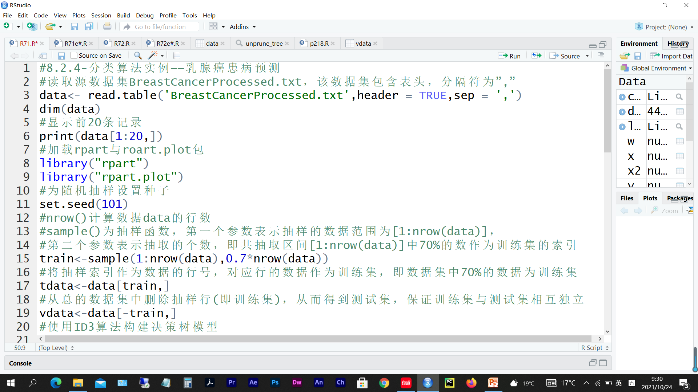
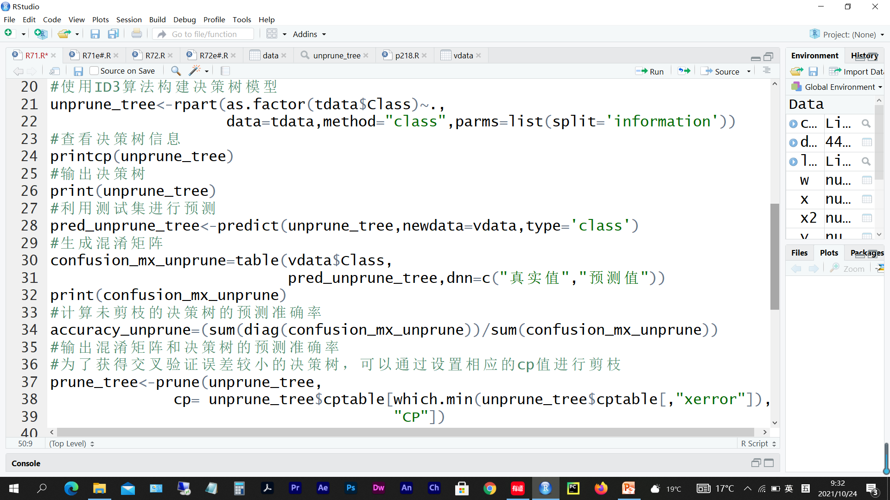
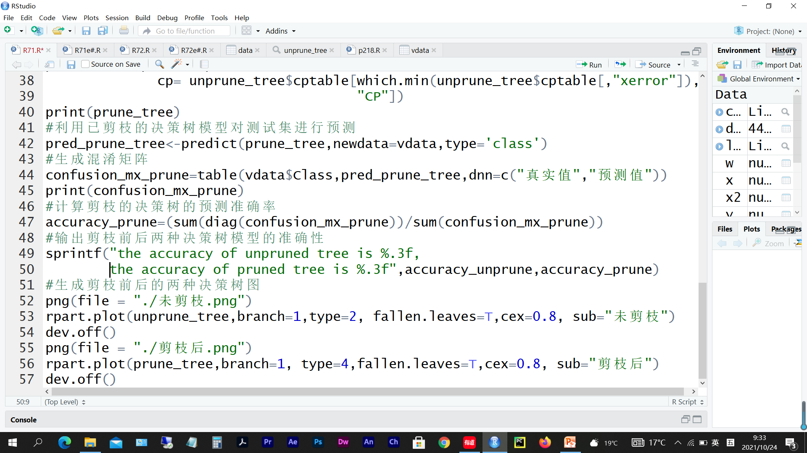
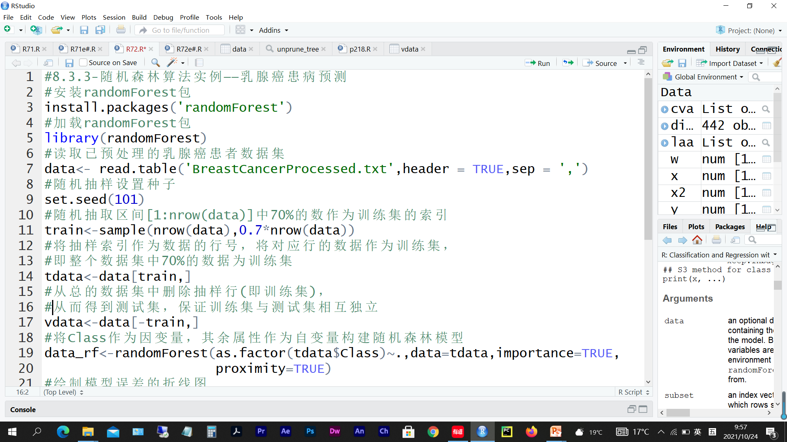
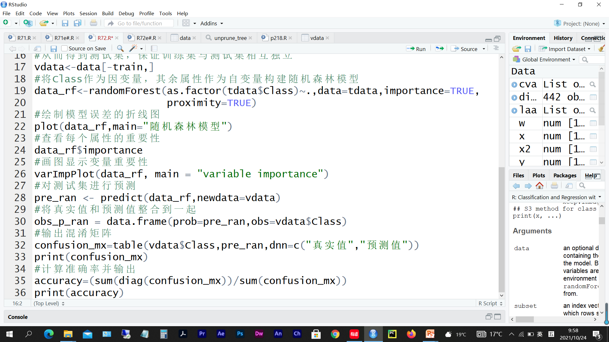

# 第 5 周　分类（一）

> 本文件由 `大数据实验5.pptx` 整理而成；
> 课件本身（.pptx）未收录进本仓库；文中的图片是幻灯片里原有的公式与数据表。

## 实验题 1

- 创建R脚本文件test0501.R，完成下面任务后把该脚本文件保存在e:/test05文件夹下。
  - （1）分类算法实例——乳腺癌患病预测。安装并加载包“rpart”与包“rpart.plot”，读取源数据集BreastCancerProcessed.txt，使用ID3算法构建决策树，并通过设置相应的cp值进行剪枝，获得交叉验证误差较小的决策树，并画出剪枝前与剪枝后的决策树图。

## 实验题 2

- 创建R脚本文件test0502.R，完成下面任务后把该脚本文件保存在e:/test05文件夹下。
  - （1）参照实验1， 将下表录入Excel(包含表头)并将14条元组复制10遍产生140条元组，然后将文件保存为CSV文件格式，并用read.csv()函数读入。画出剪枝前与剪枝后的决策树，并比较剪枝前后两种决策树模型的准确率。（录入表的格式形如下图）

| <a:txBody><a:bodyPr/><a:lstStyle/><a:p><a:pPr algn="l" fontAlgn="ctr"/><a:r><a:rPr lang="en-US" sz="1600" b="0" i="0" u="none" strike="noStrike"><a:solidFill><a:srgbClr val="000000"/></a:solidFill><a:effectLst/><a:latin typeface="宋体" panose="02010600030101010101" pitchFamily="2" charset="-122"/></a:rPr><a:t>age | <a:txBody><a:bodyPr/><a:lstStyle/><a:p><a:pPr algn="l" fontAlgn="ctr"/><a:r><a:rPr lang="en-US" sz="1600" b="0" i="0" u="none" strike="noStrike"><a:solidFill><a:srgbClr val="000000"/></a:solidFill><a:effectLst/><a:latin typeface="宋体" panose="02010600030101010101" pitchFamily="2" charset="-122"/></a:rPr><a:t>income | <a:txBody><a:bodyPr/><a:lstStyle/><a:p><a:pPr algn="l" fontAlgn="ctr"/><a:r><a:rPr lang="en-US" sz="1600" b="0" i="0" u="none" strike="noStrike"><a:solidFill><a:srgbClr val="000000"/></a:solidFill><a:effectLst/><a:latin typeface="宋体" panose="02010600030101010101" pitchFamily="2" charset="-122"/></a:rPr><a:t>student | <a:txBody><a:bodyPr/><a:lstStyle/><a:p><a:pPr algn="l" fontAlgn="ctr"/><a:r><a:rPr lang="en-US" sz="1600" b="0" i="0" u="none" strike="noStrike"><a:solidFill><a:srgbClr val="000000"/></a:solidFill><a:effectLst/><a:latin typeface="宋体" panose="02010600030101010101" pitchFamily="2" charset="-122"/></a:rPr><a:t>credit | <a:txBody><a:bodyPr/><a:lstStyle/><a:p><a:pPr algn="l" fontAlgn="ctr"/><a:r><a:rPr lang="en-US" sz="1600" b="0" i="0" u="none" strike="noStrike"><a:solidFill><a:srgbClr val="000000"/></a:solidFill><a:effectLst/><a:latin typeface="宋体" panose="02010600030101010101" pitchFamily="2" charset="-122"/></a:rPr><a:t>class |
| --- | --- | --- | --- | --- |
| <a:txBody><a:bodyPr/><a:lstStyle/><a:p><a:pPr algn="l" fontAlgn="ctr"/><a:r><a:rPr lang="en-US" sz="1600" b="0" i="0" u="none" strike="noStrike"><a:solidFill><a:srgbClr val="000000"/></a:solidFill><a:effectLst/><a:latin typeface="宋体" panose="02010600030101010101" pitchFamily="2" charset="-122"/></a:rPr><a:t>youth | <a:txBody><a:bodyPr/><a:lstStyle/><a:p><a:pPr algn="l" fontAlgn="ctr"/><a:r><a:rPr lang="en-US" sz="1600" b="0" i="0" u="none" strike="noStrike"><a:solidFill><a:srgbClr val="000000"/></a:solidFill><a:effectLst/><a:latin typeface="宋体" panose="02010600030101010101" pitchFamily="2" charset="-122"/></a:rPr><a:t>high | <a:txBody><a:bodyPr/><a:lstStyle/><a:p><a:pPr algn="l" fontAlgn="ctr"/><a:r><a:rPr lang="en-US" sz="1600" b="0" i="0" u="none" strike="noStrike"><a:solidFill><a:srgbClr val="000000"/></a:solidFill><a:effectLst/><a:latin typeface="宋体" panose="02010600030101010101" pitchFamily="2" charset="-122"/></a:rPr><a:t>no | <a:txBody><a:bodyPr/><a:lstStyle/><a:p><a:pPr algn="l" fontAlgn="ctr"/><a:r><a:rPr lang="en-US" sz="1600" b="0" i="0" u="none" strike="noStrike"><a:solidFill><a:srgbClr val="000000"/></a:solidFill><a:effectLst/><a:latin typeface="宋体" panose="02010600030101010101" pitchFamily="2" charset="-122"/></a:rPr><a:t>fair | <a:txBody><a:bodyPr/><a:lstStyle/><a:p><a:pPr algn="l" fontAlgn="ctr"/><a:r><a:rPr lang="en-US" sz="1600" b="0" i="0" u="none" strike="noStrike"><a:solidFill><a:srgbClr val="000000"/></a:solidFill><a:effectLst/><a:latin typeface="宋体" panose="02010600030101010101" pitchFamily="2" charset="-122"/></a:rPr><a:t>no |
| <a:txBody><a:bodyPr/><a:lstStyle/><a:p><a:pPr algn="l" fontAlgn="ctr"/><a:r><a:rPr lang="en-US" sz="1600" b="0" i="0" u="none" strike="noStrike"><a:solidFill><a:srgbClr val="000000"/></a:solidFill><a:effectLst/><a:latin typeface="宋体" panose="02010600030101010101" pitchFamily="2" charset="-122"/></a:rPr><a:t>youth | <a:txBody><a:bodyPr/><a:lstStyle/><a:p><a:pPr algn="l" fontAlgn="ctr"/><a:r><a:rPr lang="en-US" sz="1600" b="0" i="0" u="none" strike="noStrike"><a:solidFill><a:srgbClr val="000000"/></a:solidFill><a:effectLst/><a:latin typeface="宋体" panose="02010600030101010101" pitchFamily="2" charset="-122"/></a:rPr><a:t>high | <a:txBody><a:bodyPr/><a:lstStyle/><a:p><a:pPr algn="l" fontAlgn="ctr"/><a:r><a:rPr lang="en-US" sz="1600" b="0" i="0" u="none" strike="noStrike"><a:solidFill><a:srgbClr val="000000"/></a:solidFill><a:effectLst/><a:latin typeface="宋体" panose="02010600030101010101" pitchFamily="2" charset="-122"/></a:rPr><a:t>no | <a:txBody><a:bodyPr/><a:lstStyle/><a:p><a:pPr algn="l" fontAlgn="ctr"/><a:r><a:rPr lang="en-US" sz="1600" b="0" i="0" u="none" strike="noStrike"><a:solidFill><a:srgbClr val="000000"/></a:solidFill><a:effectLst/><a:latin typeface="宋体" panose="02010600030101010101" pitchFamily="2" charset="-122"/></a:rPr><a:t>excellent | <a:txBody><a:bodyPr/><a:lstStyle/><a:p><a:pPr algn="l" fontAlgn="ctr"/><a:r><a:rPr lang="en-US" sz="1600" b="0" i="0" u="none" strike="noStrike"><a:solidFill><a:srgbClr val="000000"/></a:solidFill><a:effectLst/><a:latin typeface="宋体" panose="02010600030101010101" pitchFamily="2" charset="-122"/></a:rPr><a:t>no |
| <a:txBody><a:bodyPr/><a:lstStyle/><a:p><a:pPr algn="l" fontAlgn="ctr"/><a:r><a:rPr lang="en-US" sz="1600" b="0" i="0" u="none" strike="noStrike"><a:solidFill><a:srgbClr val="000000"/></a:solidFill><a:effectLst/><a:latin typeface="宋体" panose="02010600030101010101" pitchFamily="2" charset="-122"/></a:rPr><a:t>middle_aged | <a:txBody><a:bodyPr/><a:lstStyle/><a:p><a:pPr algn="l" fontAlgn="ctr"/><a:r><a:rPr lang="en-US" sz="1600" b="0" i="0" u="none" strike="noStrike"><a:solidFill><a:srgbClr val="000000"/></a:solidFill><a:effectLst/><a:latin typeface="宋体" panose="02010600030101010101" pitchFamily="2" charset="-122"/></a:rPr><a:t>high | <a:txBody><a:bodyPr/><a:lstStyle/><a:p><a:pPr algn="l" fontAlgn="ctr"/><a:r><a:rPr lang="en-US" sz="1600" b="0" i="0" u="none" strike="noStrike"><a:solidFill><a:srgbClr val="000000"/></a:solidFill><a:effectLst/><a:latin typeface="宋体" panose="02010600030101010101" pitchFamily="2" charset="-122"/></a:rPr><a:t>no | <a:txBody><a:bodyPr/><a:lstStyle/><a:p><a:pPr algn="l" fontAlgn="ctr"/><a:r><a:rPr lang="en-US" sz="1600" b="0" i="0" u="none" strike="noStrike"><a:solidFill><a:srgbClr val="000000"/></a:solidFill><a:effectLst/><a:latin typeface="宋体" panose="02010600030101010101" pitchFamily="2" charset="-122"/></a:rPr><a:t>fair | <a:txBody><a:bodyPr/><a:lstStyle/><a:p><a:pPr algn="l" fontAlgn="ctr"/><a:r><a:rPr lang="en-US" sz="1600" b="0" i="0" u="none" strike="noStrike"><a:solidFill><a:srgbClr val="000000"/></a:solidFill><a:effectLst/><a:latin typeface="宋体" panose="02010600030101010101" pitchFamily="2" charset="-122"/></a:rPr><a:t>yes |
| <a:txBody><a:bodyPr/><a:lstStyle/><a:p><a:pPr algn="l" fontAlgn="ctr"/><a:r><a:rPr lang="en-US" sz="1600" b="0" i="0" u="none" strike="noStrike"><a:solidFill><a:srgbClr val="000000"/></a:solidFill><a:effectLst/><a:latin typeface="宋体" panose="02010600030101010101" pitchFamily="2" charset="-122"/></a:rPr><a:t>senior | <a:txBody><a:bodyPr/><a:lstStyle/><a:p><a:pPr algn="l" fontAlgn="ctr"/><a:r><a:rPr lang="en-US" sz="1600" b="0" i="0" u="none" strike="noStrike"><a:solidFill><a:srgbClr val="000000"/></a:solidFill><a:effectLst/><a:latin typeface="宋体" panose="02010600030101010101" pitchFamily="2" charset="-122"/></a:rPr><a:t>medium | <a:txBody><a:bodyPr/><a:lstStyle/><a:p><a:pPr algn="l" fontAlgn="ctr"/><a:r><a:rPr lang="en-US" sz="1600" b="0" i="0" u="none" strike="noStrike"><a:solidFill><a:srgbClr val="000000"/></a:solidFill><a:effectLst/><a:latin typeface="宋体" panose="02010600030101010101" pitchFamily="2" charset="-122"/></a:rPr><a:t>no | <a:txBody><a:bodyPr/><a:lstStyle/><a:p><a:pPr algn="l" fontAlgn="ctr"/><a:r><a:rPr lang="en-US" sz="1600" b="0" i="0" u="none" strike="noStrike"><a:solidFill><a:srgbClr val="000000"/></a:solidFill><a:effectLst/><a:latin typeface="宋体" panose="02010600030101010101" pitchFamily="2" charset="-122"/></a:rPr><a:t>fair | <a:txBody><a:bodyPr/><a:lstStyle/><a:p><a:pPr algn="l" fontAlgn="ctr"/><a:r><a:rPr lang="en-US" sz="1600" b="0" i="0" u="none" strike="noStrike"><a:solidFill><a:srgbClr val="000000"/></a:solidFill><a:effectLst/><a:latin typeface="宋体" panose="02010600030101010101" pitchFamily="2" charset="-122"/></a:rPr><a:t>yes |
| <a:txBody><a:bodyPr/><a:lstStyle/><a:p><a:pPr algn="l" fontAlgn="ctr"/><a:r><a:rPr lang="en-US" sz="1600" b="0" i="0" u="none" strike="noStrike"><a:solidFill><a:srgbClr val="000000"/></a:solidFill><a:effectLst/><a:latin typeface="宋体" panose="02010600030101010101" pitchFamily="2" charset="-122"/></a:rPr><a:t>senior | <a:txBody><a:bodyPr/><a:lstStyle/><a:p><a:pPr algn="l" fontAlgn="ctr"/><a:r><a:rPr lang="en-US" sz="1600" b="0" i="0" u="none" strike="noStrike"><a:solidFill><a:srgbClr val="000000"/></a:solidFill><a:effectLst/><a:latin typeface="宋体" panose="02010600030101010101" pitchFamily="2" charset="-122"/></a:rPr><a:t>low | <a:txBody><a:bodyPr/><a:lstStyle/><a:p><a:pPr algn="l" fontAlgn="ctr"/><a:r><a:rPr lang="en-US" sz="1600" b="0" i="0" u="none" strike="noStrike"><a:solidFill><a:srgbClr val="000000"/></a:solidFill><a:effectLst/><a:latin typeface="宋体" panose="02010600030101010101" pitchFamily="2" charset="-122"/></a:rPr><a:t>yes | <a:txBody><a:bodyPr/><a:lstStyle/><a:p><a:pPr algn="l" fontAlgn="ctr"/><a:r><a:rPr lang="en-US" sz="1600" b="0" i="0" u="none" strike="noStrike"><a:solidFill><a:srgbClr val="000000"/></a:solidFill><a:effectLst/><a:latin typeface="宋体" panose="02010600030101010101" pitchFamily="2" charset="-122"/></a:rPr><a:t>fair | <a:txBody><a:bodyPr/><a:lstStyle/><a:p><a:pPr algn="l" fontAlgn="ctr"/><a:r><a:rPr lang="en-US" sz="1600" b="0" i="0" u="none" strike="noStrike"><a:solidFill><a:srgbClr val="000000"/></a:solidFill><a:effectLst/><a:latin typeface="宋体" panose="02010600030101010101" pitchFamily="2" charset="-122"/></a:rPr><a:t>yes |
| <a:txBody><a:bodyPr/><a:lstStyle/><a:p><a:pPr algn="l" fontAlgn="ctr"/><a:r><a:rPr lang="en-US" sz="1600" b="0" i="0" u="none" strike="noStrike"><a:solidFill><a:srgbClr val="000000"/></a:solidFill><a:effectLst/><a:latin typeface="宋体" panose="02010600030101010101" pitchFamily="2" charset="-122"/></a:rPr><a:t>senior | <a:txBody><a:bodyPr/><a:lstStyle/><a:p><a:pPr algn="l" fontAlgn="ctr"/><a:r><a:rPr lang="en-US" sz="1600" b="0" i="0" u="none" strike="noStrike"><a:solidFill><a:srgbClr val="000000"/></a:solidFill><a:effectLst/><a:latin typeface="宋体" panose="02010600030101010101" pitchFamily="2" charset="-122"/></a:rPr><a:t>low | <a:txBody><a:bodyPr/><a:lstStyle/><a:p><a:pPr algn="l" fontAlgn="ctr"/><a:r><a:rPr lang="en-US" sz="1600" b="0" i="0" u="none" strike="noStrike"><a:solidFill><a:srgbClr val="000000"/></a:solidFill><a:effectLst/><a:latin typeface="宋体" panose="02010600030101010101" pitchFamily="2" charset="-122"/></a:rPr><a:t>yes | <a:txBody><a:bodyPr/><a:lstStyle/><a:p><a:pPr algn="l" fontAlgn="ctr"/><a:r><a:rPr lang="en-US" sz="1600" b="0" i="0" u="none" strike="noStrike"><a:solidFill><a:srgbClr val="000000"/></a:solidFill><a:effectLst/><a:latin typeface="宋体" panose="02010600030101010101" pitchFamily="2" charset="-122"/></a:rPr><a:t>excellent | <a:txBody><a:bodyPr/><a:lstStyle/><a:p><a:pPr algn="l" fontAlgn="ctr"/><a:r><a:rPr lang="en-US" sz="1600" b="0" i="0" u="none" strike="noStrike"><a:solidFill><a:srgbClr val="000000"/></a:solidFill><a:effectLst/><a:latin typeface="宋体" panose="02010600030101010101" pitchFamily="2" charset="-122"/></a:rPr><a:t>no |
| <a:txBody><a:bodyPr/><a:lstStyle/><a:p><a:pPr algn="l" fontAlgn="ctr"/><a:r><a:rPr lang="en-US" sz="1600" b="0" i="0" u="none" strike="noStrike"><a:solidFill><a:srgbClr val="000000"/></a:solidFill><a:effectLst/><a:latin typeface="宋体" panose="02010600030101010101" pitchFamily="2" charset="-122"/></a:rPr><a:t>middle_aged | <a:txBody><a:bodyPr/><a:lstStyle/><a:p><a:pPr algn="l" fontAlgn="ctr"/><a:r><a:rPr lang="en-US" sz="1600" b="0" i="0" u="none" strike="noStrike"><a:solidFill><a:srgbClr val="000000"/></a:solidFill><a:effectLst/><a:latin typeface="宋体" panose="02010600030101010101" pitchFamily="2" charset="-122"/></a:rPr><a:t>low | <a:txBody><a:bodyPr/><a:lstStyle/><a:p><a:pPr algn="l" fontAlgn="ctr"/><a:r><a:rPr lang="en-US" sz="1600" b="0" i="0" u="none" strike="noStrike"><a:solidFill><a:srgbClr val="000000"/></a:solidFill><a:effectLst/><a:latin typeface="宋体" panose="02010600030101010101" pitchFamily="2" charset="-122"/></a:rPr><a:t>yes | <a:txBody><a:bodyPr/><a:lstStyle/><a:p><a:pPr algn="l" fontAlgn="ctr"/><a:r><a:rPr lang="en-US" sz="1600" b="0" i="0" u="none" strike="noStrike"><a:solidFill><a:srgbClr val="000000"/></a:solidFill><a:effectLst/><a:latin typeface="宋体" panose="02010600030101010101" pitchFamily="2" charset="-122"/></a:rPr><a:t>excellent | <a:txBody><a:bodyPr/><a:lstStyle/><a:p><a:pPr algn="l" fontAlgn="ctr"/><a:r><a:rPr lang="en-US" sz="1600" b="0" i="0" u="none" strike="noStrike"><a:solidFill><a:srgbClr val="000000"/></a:solidFill><a:effectLst/><a:latin typeface="宋体" panose="02010600030101010101" pitchFamily="2" charset="-122"/></a:rPr><a:t>yes |
| <a:txBody><a:bodyPr/><a:lstStyle/><a:p><a:pPr algn="l" fontAlgn="ctr"/><a:r><a:rPr lang="en-US" sz="1600" b="0" i="0" u="none" strike="noStrike"><a:solidFill><a:srgbClr val="000000"/></a:solidFill><a:effectLst/><a:latin typeface="宋体" panose="02010600030101010101" pitchFamily="2" charset="-122"/></a:rPr><a:t>youth | <a:txBody><a:bodyPr/><a:lstStyle/><a:p><a:pPr algn="l" fontAlgn="ctr"/><a:r><a:rPr lang="en-US" sz="1600" b="0" i="0" u="none" strike="noStrike"><a:solidFill><a:srgbClr val="000000"/></a:solidFill><a:effectLst/><a:latin typeface="宋体" panose="02010600030101010101" pitchFamily="2" charset="-122"/></a:rPr><a:t>medium | <a:txBody><a:bodyPr/><a:lstStyle/><a:p><a:pPr algn="l" fontAlgn="ctr"/><a:r><a:rPr lang="en-US" sz="1600" b="0" i="0" u="none" strike="noStrike"><a:solidFill><a:srgbClr val="000000"/></a:solidFill><a:effectLst/><a:latin typeface="宋体" panose="02010600030101010101" pitchFamily="2" charset="-122"/></a:rPr><a:t>no | <a:txBody><a:bodyPr/><a:lstStyle/><a:p><a:pPr algn="l" fontAlgn="ctr"/><a:r><a:rPr lang="en-US" sz="1600" b="0" i="0" u="none" strike="noStrike"><a:solidFill><a:srgbClr val="000000"/></a:solidFill><a:effectLst/><a:latin typeface="宋体" panose="02010600030101010101" pitchFamily="2" charset="-122"/></a:rPr><a:t>fair | <a:txBody><a:bodyPr/><a:lstStyle/><a:p><a:pPr algn="l" fontAlgn="ctr"/><a:r><a:rPr lang="en-US" sz="1600" b="0" i="0" u="none" strike="noStrike"><a:solidFill><a:srgbClr val="000000"/></a:solidFill><a:effectLst/><a:latin typeface="宋体" panose="02010600030101010101" pitchFamily="2" charset="-122"/></a:rPr><a:t>no |
| <a:txBody><a:bodyPr/><a:lstStyle/><a:p><a:pPr algn="l" fontAlgn="ctr"/><a:r><a:rPr lang="en-US" sz="1600" b="0" i="0" u="none" strike="noStrike"><a:solidFill><a:srgbClr val="000000"/></a:solidFill><a:effectLst/><a:latin typeface="宋体" panose="02010600030101010101" pitchFamily="2" charset="-122"/></a:rPr><a:t>youth | <a:txBody><a:bodyPr/><a:lstStyle/><a:p><a:pPr algn="l" fontAlgn="ctr"/><a:r><a:rPr lang="en-US" sz="1600" b="0" i="0" u="none" strike="noStrike"><a:solidFill><a:srgbClr val="000000"/></a:solidFill><a:effectLst/><a:latin typeface="宋体" panose="02010600030101010101" pitchFamily="2" charset="-122"/></a:rPr><a:t>low | <a:txBody><a:bodyPr/><a:lstStyle/><a:p><a:pPr algn="l" fontAlgn="ctr"/><a:r><a:rPr lang="en-US" sz="1600" b="0" i="0" u="none" strike="noStrike"><a:solidFill><a:srgbClr val="000000"/></a:solidFill><a:effectLst/><a:latin typeface="宋体" panose="02010600030101010101" pitchFamily="2" charset="-122"/></a:rPr><a:t>yes | <a:txBody><a:bodyPr/><a:lstStyle/><a:p><a:pPr algn="l" fontAlgn="ctr"/><a:r><a:rPr lang="en-US" sz="1600" b="0" i="0" u="none" strike="noStrike"><a:solidFill><a:srgbClr val="000000"/></a:solidFill><a:effectLst/><a:latin typeface="宋体" panose="02010600030101010101" pitchFamily="2" charset="-122"/></a:rPr><a:t>fair | <a:txBody><a:bodyPr/><a:lstStyle/><a:p><a:pPr algn="l" fontAlgn="ctr"/><a:r><a:rPr lang="en-US" sz="1600" b="0" i="0" u="none" strike="noStrike"><a:solidFill><a:srgbClr val="000000"/></a:solidFill><a:effectLst/><a:latin typeface="宋体" panose="02010600030101010101" pitchFamily="2" charset="-122"/></a:rPr><a:t>yes |
| <a:txBody><a:bodyPr/><a:lstStyle/><a:p><a:pPr algn="l" fontAlgn="ctr"/><a:r><a:rPr lang="en-US" sz="1600" b="0" i="0" u="none" strike="noStrike"><a:solidFill><a:srgbClr val="000000"/></a:solidFill><a:effectLst/><a:latin typeface="宋体" panose="02010600030101010101" pitchFamily="2" charset="-122"/></a:rPr><a:t>senior | <a:txBody><a:bodyPr/><a:lstStyle/><a:p><a:pPr algn="l" fontAlgn="ctr"/><a:r><a:rPr lang="en-US" sz="1600" b="0" i="0" u="none" strike="noStrike"><a:solidFill><a:srgbClr val="000000"/></a:solidFill><a:effectLst/><a:latin typeface="宋体" panose="02010600030101010101" pitchFamily="2" charset="-122"/></a:rPr><a:t>medium | <a:txBody><a:bodyPr/><a:lstStyle/><a:p><a:pPr algn="l" fontAlgn="ctr"/><a:r><a:rPr lang="en-US" sz="1600" b="0" i="0" u="none" strike="noStrike"><a:solidFill><a:srgbClr val="000000"/></a:solidFill><a:effectLst/><a:latin typeface="宋体" panose="02010600030101010101" pitchFamily="2" charset="-122"/></a:rPr><a:t>yes | <a:txBody><a:bodyPr/><a:lstStyle/><a:p><a:pPr algn="l" fontAlgn="ctr"/><a:r><a:rPr lang="en-US" sz="1600" b="0" i="0" u="none" strike="noStrike"><a:solidFill><a:srgbClr val="000000"/></a:solidFill><a:effectLst/><a:latin typeface="宋体" panose="02010600030101010101" pitchFamily="2" charset="-122"/></a:rPr><a:t>fair | <a:txBody><a:bodyPr/><a:lstStyle/><a:p><a:pPr algn="l" fontAlgn="ctr"/><a:r><a:rPr lang="en-US" sz="1600" b="0" i="0" u="none" strike="noStrike"><a:solidFill><a:srgbClr val="000000"/></a:solidFill><a:effectLst/><a:latin typeface="宋体" panose="02010600030101010101" pitchFamily="2" charset="-122"/></a:rPr><a:t>yes |
| <a:txBody><a:bodyPr/><a:lstStyle/><a:p><a:pPr algn="l" fontAlgn="ctr"/><a:r><a:rPr lang="en-US" sz="1600" b="0" i="0" u="none" strike="noStrike"><a:solidFill><a:srgbClr val="000000"/></a:solidFill><a:effectLst/><a:latin typeface="宋体" panose="02010600030101010101" pitchFamily="2" charset="-122"/></a:rPr><a:t>youth | <a:txBody><a:bodyPr/><a:lstStyle/><a:p><a:pPr algn="l" fontAlgn="ctr"/><a:r><a:rPr lang="en-US" sz="1600" b="0" i="0" u="none" strike="noStrike"><a:solidFill><a:srgbClr val="000000"/></a:solidFill><a:effectLst/><a:latin typeface="宋体" panose="02010600030101010101" pitchFamily="2" charset="-122"/></a:rPr><a:t>medium | <a:txBody><a:bodyPr/><a:lstStyle/><a:p><a:pPr algn="l" fontAlgn="ctr"/><a:r><a:rPr lang="en-US" sz="1600" b="0" i="0" u="none" strike="noStrike"><a:solidFill><a:srgbClr val="000000"/></a:solidFill><a:effectLst/><a:latin typeface="宋体" panose="02010600030101010101" pitchFamily="2" charset="-122"/></a:rPr><a:t>yes | <a:txBody><a:bodyPr/><a:lstStyle/><a:p><a:pPr algn="l" fontAlgn="ctr"/><a:r><a:rPr lang="en-US" sz="1600" b="0" i="0" u="none" strike="noStrike"><a:solidFill><a:srgbClr val="000000"/></a:solidFill><a:effectLst/><a:latin typeface="宋体" panose="02010600030101010101" pitchFamily="2" charset="-122"/></a:rPr><a:t>excellent | <a:txBody><a:bodyPr/><a:lstStyle/><a:p><a:pPr algn="l" fontAlgn="ctr"/><a:r><a:rPr lang="en-US" sz="1600" b="0" i="0" u="none" strike="noStrike"><a:solidFill><a:srgbClr val="000000"/></a:solidFill><a:effectLst/><a:latin typeface="宋体" panose="02010600030101010101" pitchFamily="2" charset="-122"/></a:rPr><a:t>yes |
| <a:txBody><a:bodyPr/><a:lstStyle/><a:p><a:pPr algn="l" fontAlgn="ctr"/><a:r><a:rPr lang="en-US" sz="1600" b="0" i="0" u="none" strike="noStrike"><a:solidFill><a:srgbClr val="000000"/></a:solidFill><a:effectLst/><a:latin typeface="宋体" panose="02010600030101010101" pitchFamily="2" charset="-122"/></a:rPr><a:t>middle_aged | <a:txBody><a:bodyPr/><a:lstStyle/><a:p><a:pPr algn="l" fontAlgn="ctr"/><a:r><a:rPr lang="en-US" sz="1600" b="0" i="0" u="none" strike="noStrike"><a:solidFill><a:srgbClr val="000000"/></a:solidFill><a:effectLst/><a:latin typeface="宋体" panose="02010600030101010101" pitchFamily="2" charset="-122"/></a:rPr><a:t>medium | <a:txBody><a:bodyPr/><a:lstStyle/><a:p><a:pPr algn="l" fontAlgn="ctr"/><a:r><a:rPr lang="en-US" sz="1600" b="0" i="0" u="none" strike="noStrike"><a:solidFill><a:srgbClr val="000000"/></a:solidFill><a:effectLst/><a:latin typeface="宋体" panose="02010600030101010101" pitchFamily="2" charset="-122"/></a:rPr><a:t>no | <a:txBody><a:bodyPr/><a:lstStyle/><a:p><a:pPr algn="l" fontAlgn="ctr"/><a:r><a:rPr lang="en-US" sz="1600" b="0" i="0" u="none" strike="noStrike"><a:solidFill><a:srgbClr val="000000"/></a:solidFill><a:effectLst/><a:latin typeface="宋体" panose="02010600030101010101" pitchFamily="2" charset="-122"/></a:rPr><a:t>excellent | <a:txBody><a:bodyPr/><a:lstStyle/><a:p><a:pPr algn="l" fontAlgn="ctr"/><a:r><a:rPr lang="en-US" sz="1600" b="0" i="0" u="none" strike="noStrike"><a:solidFill><a:srgbClr val="000000"/></a:solidFill><a:effectLst/><a:latin typeface="宋体" panose="02010600030101010101" pitchFamily="2" charset="-122"/></a:rPr><a:t>yes |
| <a:txBody><a:bodyPr/><a:lstStyle/><a:p><a:pPr algn="l" fontAlgn="ctr"/><a:r><a:rPr lang="en-US" sz="1600" b="0" i="0" u="none" strike="noStrike"><a:solidFill><a:srgbClr val="000000"/></a:solidFill><a:effectLst/><a:latin typeface="宋体" panose="02010600030101010101" pitchFamily="2" charset="-122"/></a:rPr><a:t>middle_aged | <a:txBody><a:bodyPr/><a:lstStyle/><a:p><a:pPr algn="l" fontAlgn="ctr"/><a:r><a:rPr lang="en-US" sz="1600" b="0" i="0" u="none" strike="noStrike"><a:solidFill><a:srgbClr val="000000"/></a:solidFill><a:effectLst/><a:latin typeface="宋体" panose="02010600030101010101" pitchFamily="2" charset="-122"/></a:rPr><a:t>high | <a:txBody><a:bodyPr/><a:lstStyle/><a:p><a:pPr algn="l" fontAlgn="ctr"/><a:r><a:rPr lang="en-US" sz="1600" b="0" i="0" u="none" strike="noStrike"><a:solidFill><a:srgbClr val="000000"/></a:solidFill><a:effectLst/><a:latin typeface="宋体" panose="02010600030101010101" pitchFamily="2" charset="-122"/></a:rPr><a:t>yes | <a:txBody><a:bodyPr/><a:lstStyle/><a:p><a:pPr algn="l" fontAlgn="ctr"/><a:r><a:rPr lang="en-US" sz="1600" b="0" i="0" u="none" strike="noStrike"><a:solidFill><a:srgbClr val="000000"/></a:solidFill><a:effectLst/><a:latin typeface="宋体" panose="02010600030101010101" pitchFamily="2" charset="-122"/></a:rPr><a:t>fair | <a:txBody><a:bodyPr/><a:lstStyle/><a:p><a:pPr algn="l" fontAlgn="ctr"/><a:r><a:rPr lang="en-US" sz="1600" b="0" i="0" u="none" strike="noStrike"><a:solidFill><a:srgbClr val="000000"/></a:solidFill><a:effectLst/><a:latin typeface="宋体" panose="02010600030101010101" pitchFamily="2" charset="-122"/></a:rPr><a:t>yes |
| <a:txBody><a:bodyPr/><a:lstStyle/><a:p><a:pPr algn="l" fontAlgn="ctr"/><a:r><a:rPr lang="en-US" sz="1600" b="0" i="0" u="none" strike="noStrike"><a:solidFill><a:srgbClr val="000000"/></a:solidFill><a:effectLst/><a:latin typeface="宋体" panose="02010600030101010101" pitchFamily="2" charset="-122"/></a:rPr><a:t>senior | <a:txBody><a:bodyPr/><a:lstStyle/><a:p><a:pPr algn="l" fontAlgn="ctr"/><a:r><a:rPr lang="en-US" sz="1600" b="0" i="0" u="none" strike="noStrike"><a:solidFill><a:srgbClr val="000000"/></a:solidFill><a:effectLst/><a:latin typeface="宋体" panose="02010600030101010101" pitchFamily="2" charset="-122"/></a:rPr><a:t>medium | <a:txBody><a:bodyPr/><a:lstStyle/><a:p><a:pPr algn="l" fontAlgn="ctr"/><a:r><a:rPr lang="en-US" sz="1600" b="0" i="0" u="none" strike="noStrike"><a:solidFill><a:srgbClr val="000000"/></a:solidFill><a:effectLst/><a:latin typeface="宋体" panose="02010600030101010101" pitchFamily="2" charset="-122"/></a:rPr><a:t>no | <a:txBody><a:bodyPr/><a:lstStyle/><a:p><a:pPr algn="l" fontAlgn="ctr"/><a:r><a:rPr lang="en-US" sz="1600" b="0" i="0" u="none" strike="noStrike"><a:solidFill><a:srgbClr val="000000"/></a:solidFill><a:effectLst/><a:latin typeface="宋体" panose="02010600030101010101" pitchFamily="2" charset="-122"/></a:rPr><a:t>excellent | <a:txBody><a:bodyPr/><a:lstStyle/><a:p><a:pPr algn="l" fontAlgn="ctr"/><a:r><a:rPr lang="en-US" sz="1600" b="0" i="0" u="none" strike="noStrike" dirty="0"><a:solidFill><a:srgbClr val="000000"/></a:solidFill><a:effectLst/><a:latin typeface="宋体" panose="02010600030101010101" pitchFamily="2" charset="-122"/></a:rPr><a:t>no |

## 实验题 3

- 创建R脚本文件test0503.R，完成下面任务后把该脚本文件保存在e:/test05文件夹下。
  - （1）随机森林算法实例——乳腺癌患病预测。安装并加载randomForest包，运用randomForest()函数产生500棵树，并画出模型误差的折线图及变量重要性图。

