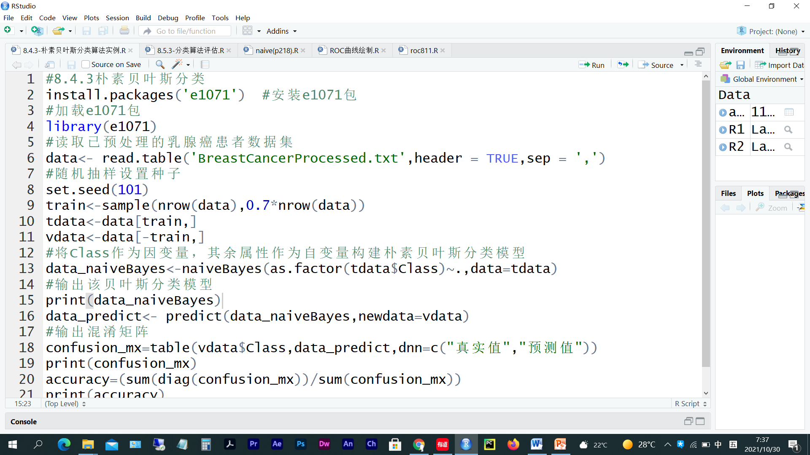
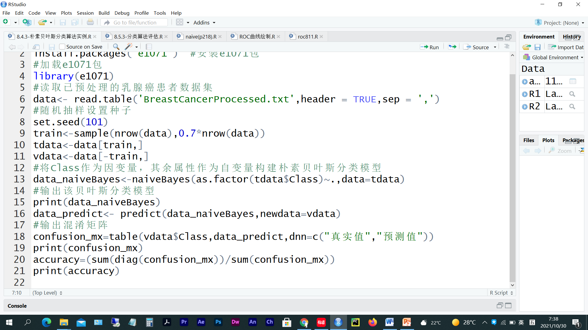
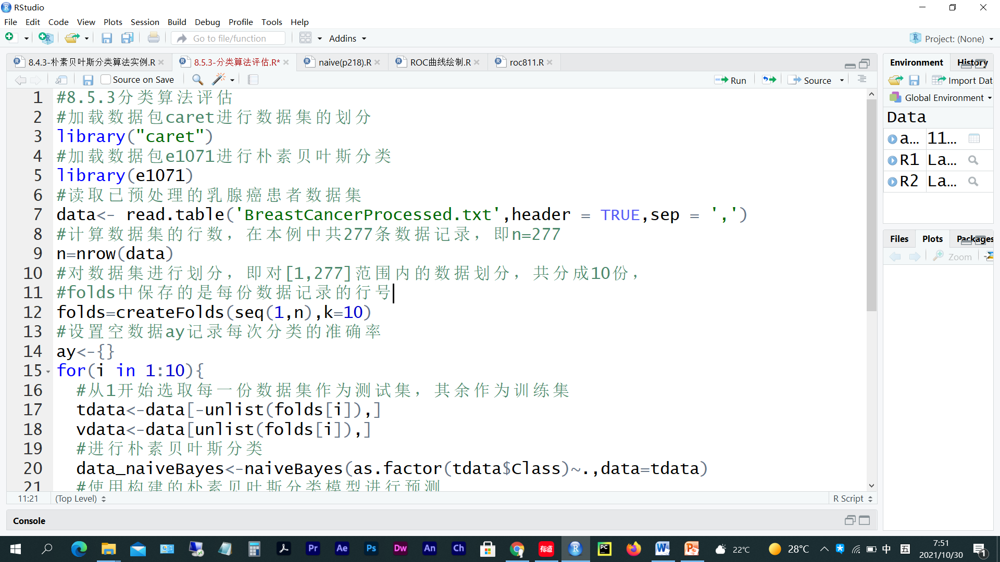
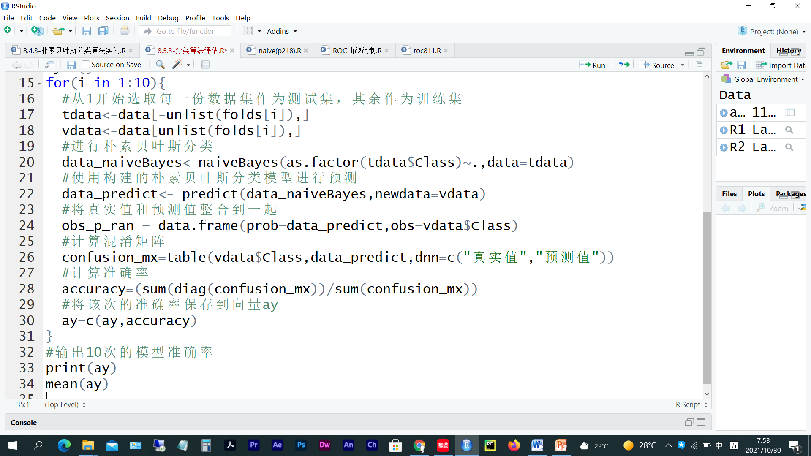
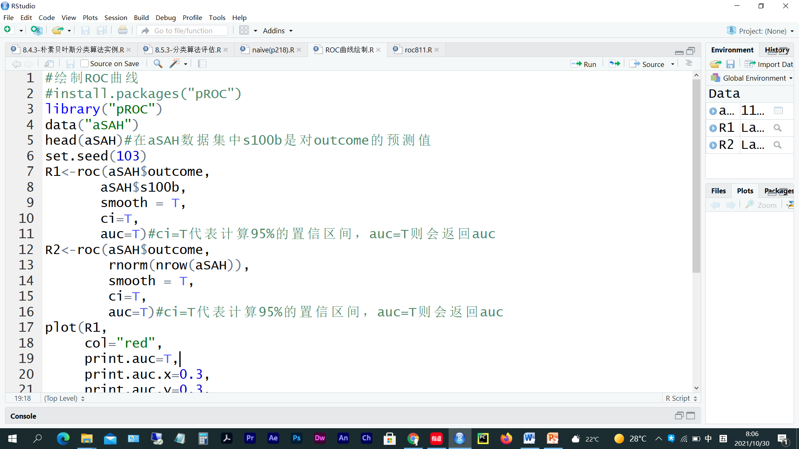
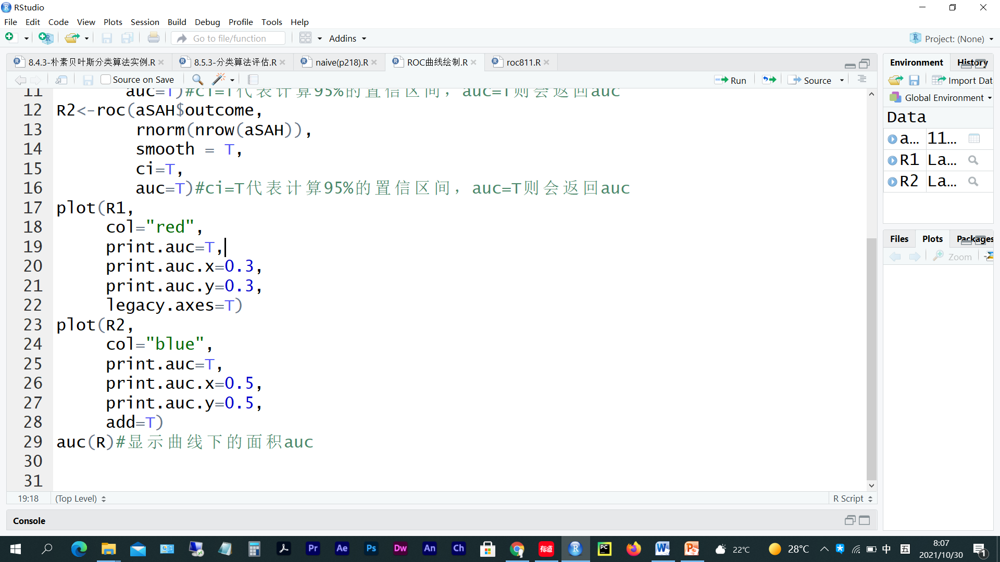

# 第 6 周　分类（二）

> 本文件由 `大数据实验6.pptx` 整理而成；
> 课件本身（.pptx）未收录进本仓库；文中的图片是幻灯片里原有的公式与数据表。

## 实验题 1

- 创建R脚本文件test0601.R，完成下面任务后把该脚本文件保存在e:/test06文件夹下。
  - （1）朴素贝叶斯分类算法实例——乳腺癌患病预测。安装并加载包“e1071”，读取源数据集BreastCancerProcessed.txt，将Class作为因变量，其余属性作为自变量构建朴素贝叶斯分类模型，输出混淆矩阵，并计算模型的准确率。

## 实验题 2

- 创建R脚本文件test0602.R，完成下面任务后把该脚本文件保存在e:/test06文件夹下。
  - （1）安装并加载包“caret”及加载包“e1071 ”，读取源数据集BreastCancerProcessed.txt，将朴素贝叶斯分类算法进行10-折交叉验证，并输出10次模型的准确率。

## 实验题 3

- 创建R脚本文件test0603.R，完成下面任务后把该脚本文件保存在e:/test06文件夹下。
  - （1）安装并加载包“pROC ”，使用pROC包自带的aSAH数据集来绘制ROC曲线。该数据集包括了113例动脉瘤蛛网膜下腔出血患者的临床和实验室资料，在pROC包中，使用roc()函数来建立ROC对象。默认情况下roc()函数会输出AUC的值。

## 实验题 4

- 创建R脚本文件test0604.R，完成下面任务后把该脚本文件保存在e:/test06文件夹下。
  - （1）根据下面的数据(如下图)，参照实验3的代码，绘制ROC图。

| <a:txBody><a:bodyPr/><a:lstStyle/><a:p><a:pPr algn="ctr" fontAlgn="b"/><a:r><a:rPr lang="zh-CN" altLang="en-US" sz="2100" u="none" strike="noStrike" dirty="0"><a:effectLst/></a:rPr><a:t>元组编号 | <a:txBody><a:bodyPr/><a:lstStyle/><a:p><a:pPr algn="ctr" fontAlgn="b"/><a:r><a:rPr lang="zh-CN" altLang="en-US" sz="2100" u="none" strike="noStrike"><a:effectLst/></a:rPr><a:t>类 | <a:txBody><a:bodyPr/><a:lstStyle/><a:p><a:pPr algn="ctr" fontAlgn="b"/><a:r><a:rPr lang="zh-CN" altLang="en-US" sz="2100" u="none" strike="noStrike"><a:effectLst/></a:rPr><a:t>概率 | <a:txBody><a:bodyPr/><a:lstStyle/><a:p><a:pPr algn="ctr" fontAlgn="b"/><a:r><a:rPr lang="en-US" sz="2100" u="none" strike="noStrike"><a:effectLst/></a:rPr><a:t>TP | <a:txBody><a:bodyPr/><a:lstStyle/><a:p><a:pPr algn="ctr" fontAlgn="b"/><a:r><a:rPr lang="en-US" sz="2100" u="none" strike="noStrike"><a:effectLst/></a:rPr><a:t>FP | <a:txBody><a:bodyPr/><a:lstStyle/><a:p><a:pPr algn="ctr" fontAlgn="b"/><a:r><a:rPr lang="en-US" sz="2100" u="none" strike="noStrike"><a:effectLst/></a:rPr><a:t>TN | <a:txBody><a:bodyPr/><a:lstStyle/><a:p><a:pPr algn="ctr" fontAlgn="b"/><a:r><a:rPr lang="en-US" sz="2100" u="none" strike="noStrike"><a:effectLst/></a:rPr><a:t>FN | <a:txBody><a:bodyPr/><a:lstStyle/><a:p><a:pPr algn="ctr" fontAlgn="b"/><a:r><a:rPr lang="en-US" sz="2100" u="none" strike="noStrike"><a:effectLst/></a:rPr><a:t>TPR | <a:txBody><a:bodyPr/><a:lstStyle/><a:p><a:pPr algn="ctr" fontAlgn="b"/><a:r><a:rPr lang="en-US" sz="2100" u="none" strike="noStrike"><a:effectLst/></a:rPr><a:t>FPR |
| --- | --- | --- | --- | --- | --- | --- | --- | --- |
| <a:txBody><a:bodyPr/><a:lstStyle/><a:p><a:pPr algn="ctr" fontAlgn="b"/><a:r><a:rPr lang="en-US" altLang="zh-CN" sz="2100" u="none" strike="noStrike"><a:effectLst/></a:rPr><a:t>1 | <a:txBody><a:bodyPr/><a:lstStyle/><a:p><a:pPr algn="ctr" fontAlgn="b"/><a:r><a:rPr lang="en-US" sz="2100" u="none" strike="noStrike"><a:effectLst/></a:rPr><a:t>P | <a:txBody><a:bodyPr/><a:lstStyle/><a:p><a:pPr algn="ctr" fontAlgn="b"/><a:r><a:rPr lang="en-US" altLang="zh-CN" sz="2100" u="none" strike="noStrike"><a:effectLst/></a:rPr><a:t>0.90 | <a:txBody><a:bodyPr/><a:lstStyle/><a:p><a:pPr algn="r" fontAlgn="b"/><a:r><a:rPr lang="en-US" altLang="zh-CN" sz="2100" u="none" strike="noStrike"><a:effectLst/></a:rPr><a:t>1 | <a:txBody><a:bodyPr/><a:lstStyle/><a:p><a:pPr algn="r" fontAlgn="b"/><a:r><a:rPr lang="en-US" altLang="zh-CN" sz="2100" u="none" strike="noStrike"><a:effectLst/></a:rPr><a:t>0 | <a:txBody><a:bodyPr/><a:lstStyle/><a:p><a:pPr algn="r" fontAlgn="b"/><a:r><a:rPr lang="en-US" altLang="zh-CN" sz="2100" u="none" strike="noStrike"><a:effectLst/></a:rPr><a:t>5 | <a:txBody><a:bodyPr/><a:lstStyle/><a:p><a:pPr algn="r" fontAlgn="b"/><a:r><a:rPr lang="en-US" altLang="zh-CN" sz="2100" u="none" strike="noStrike"><a:effectLst/></a:rPr><a:t>4 | <a:txBody><a:bodyPr/><a:lstStyle/><a:p><a:pPr algn="r" fontAlgn="b"/><a:r><a:rPr lang="en-US" altLang="zh-CN" sz="2100" u="none" strike="noStrike"><a:effectLst/></a:rPr><a:t>0.2 | <a:txBody><a:bodyPr/><a:lstStyle/><a:p><a:pPr algn="r" fontAlgn="b"/><a:r><a:rPr lang="en-US" altLang="zh-CN" sz="2100" u="none" strike="noStrike"><a:effectLst/></a:rPr><a:t>0.0 |
| <a:txBody><a:bodyPr/><a:lstStyle/><a:p><a:pPr algn="ctr" fontAlgn="b"/><a:r><a:rPr lang="en-US" altLang="zh-CN" sz="2100" u="none" strike="noStrike"><a:effectLst/></a:rPr><a:t>2 | <a:txBody><a:bodyPr/><a:lstStyle/><a:p><a:pPr algn="ctr" fontAlgn="b"/><a:r><a:rPr lang="en-US" sz="2100" u="none" strike="noStrike"><a:effectLst/></a:rPr><a:t>P | <a:txBody><a:bodyPr/><a:lstStyle/><a:p><a:pPr algn="ctr" fontAlgn="b"/><a:r><a:rPr lang="en-US" altLang="zh-CN" sz="2100" u="none" strike="noStrike"><a:effectLst/></a:rPr><a:t>0.80 | <a:txBody><a:bodyPr/><a:lstStyle/><a:p><a:pPr algn="r" fontAlgn="b"/><a:r><a:rPr lang="en-US" altLang="zh-CN" sz="2100" u="none" strike="noStrike"><a:effectLst/></a:rPr><a:t>2 | <a:txBody><a:bodyPr/><a:lstStyle/><a:p><a:pPr algn="r" fontAlgn="b"/><a:r><a:rPr lang="en-US" altLang="zh-CN" sz="2100" u="none" strike="noStrike"><a:effectLst/></a:rPr><a:t>0 | <a:txBody><a:bodyPr/><a:lstStyle/><a:p><a:pPr algn="r" fontAlgn="b"/><a:r><a:rPr lang="en-US" altLang="zh-CN" sz="2100" u="none" strike="noStrike"><a:effectLst/></a:rPr><a:t>5 | <a:txBody><a:bodyPr/><a:lstStyle/><a:p><a:pPr algn="r" fontAlgn="b"/><a:r><a:rPr lang="en-US" altLang="zh-CN" sz="2100" u="none" strike="noStrike"><a:effectLst/></a:rPr><a:t>3 | <a:txBody><a:bodyPr/><a:lstStyle/><a:p><a:pPr algn="r" fontAlgn="b"/><a:r><a:rPr lang="en-US" altLang="zh-CN" sz="2100" u="none" strike="noStrike"><a:effectLst/></a:rPr><a:t>0.4 | <a:txBody><a:bodyPr/><a:lstStyle/><a:p><a:pPr algn="r" fontAlgn="b"/><a:r><a:rPr lang="en-US" altLang="zh-CN" sz="2100" u="none" strike="noStrike" dirty="0"><a:effectLst/></a:rPr><a:t>0.0 |
| <a:txBody><a:bodyPr/><a:lstStyle/><a:p><a:pPr algn="ctr" fontAlgn="b"/><a:r><a:rPr lang="en-US" altLang="zh-CN" sz="2100" u="none" strike="noStrike"><a:effectLst/></a:rPr><a:t>3 | <a:txBody><a:bodyPr/><a:lstStyle/><a:p><a:pPr algn="ctr" fontAlgn="b"/><a:r><a:rPr lang="en-US" sz="2100" u="none" strike="noStrike"><a:effectLst/></a:rPr><a:t>N | <a:txBody><a:bodyPr/><a:lstStyle/><a:p><a:pPr algn="ctr" fontAlgn="b"/><a:r><a:rPr lang="en-US" altLang="zh-CN" sz="2100" u="none" strike="noStrike"><a:effectLst/></a:rPr><a:t>0.70 | <a:txBody><a:bodyPr/><a:lstStyle/><a:p><a:pPr algn="r" fontAlgn="b"/><a:r><a:rPr lang="en-US" altLang="zh-CN" sz="2100" u="none" strike="noStrike"><a:effectLst/></a:rPr><a:t>2 | <a:txBody><a:bodyPr/><a:lstStyle/><a:p><a:pPr algn="r" fontAlgn="b"/><a:r><a:rPr lang="en-US" altLang="zh-CN" sz="2100" u="none" strike="noStrike"><a:effectLst/></a:rPr><a:t>1 | <a:txBody><a:bodyPr/><a:lstStyle/><a:p><a:pPr algn="r" fontAlgn="b"/><a:r><a:rPr lang="en-US" altLang="zh-CN" sz="2100" u="none" strike="noStrike"><a:effectLst/></a:rPr><a:t>4 | <a:txBody><a:bodyPr/><a:lstStyle/><a:p><a:pPr algn="r" fontAlgn="b"/><a:r><a:rPr lang="en-US" altLang="zh-CN" sz="2100" u="none" strike="noStrike"><a:effectLst/></a:rPr><a:t>3 | <a:txBody><a:bodyPr/><a:lstStyle/><a:p><a:pPr algn="r" fontAlgn="b"/><a:r><a:rPr lang="en-US" altLang="zh-CN" sz="2100" u="none" strike="noStrike"><a:effectLst/></a:rPr><a:t>0.4 | <a:txBody><a:bodyPr/><a:lstStyle/><a:p><a:pPr algn="r" fontAlgn="b"/><a:r><a:rPr lang="en-US" altLang="zh-CN" sz="2100" u="none" strike="noStrike"><a:effectLst/></a:rPr><a:t>0.2 |
| <a:txBody><a:bodyPr/><a:lstStyle/><a:p><a:pPr algn="ctr" fontAlgn="b"/><a:r><a:rPr lang="en-US" altLang="zh-CN" sz="2100" u="none" strike="noStrike"><a:effectLst/></a:rPr><a:t>4 | <a:txBody><a:bodyPr/><a:lstStyle/><a:p><a:pPr algn="ctr" fontAlgn="b"/><a:r><a:rPr lang="en-US" sz="2100" u="none" strike="noStrike"><a:effectLst/></a:rPr><a:t>P | <a:txBody><a:bodyPr/><a:lstStyle/><a:p><a:pPr algn="ctr" fontAlgn="b"/><a:r><a:rPr lang="en-US" altLang="zh-CN" sz="2100" u="none" strike="noStrike"><a:effectLst/></a:rPr><a:t>0.60 | <a:txBody><a:bodyPr/><a:lstStyle/><a:p><a:pPr algn="r" fontAlgn="b"/><a:r><a:rPr lang="en-US" altLang="zh-CN" sz="2100" u="none" strike="noStrike"><a:effectLst/></a:rPr><a:t>3 | <a:txBody><a:bodyPr/><a:lstStyle/><a:p><a:pPr algn="r" fontAlgn="b"/><a:r><a:rPr lang="en-US" altLang="zh-CN" sz="2100" u="none" strike="noStrike"><a:effectLst/></a:rPr><a:t>1 | <a:txBody><a:bodyPr/><a:lstStyle/><a:p><a:pPr algn="r" fontAlgn="b"/><a:r><a:rPr lang="en-US" altLang="zh-CN" sz="2100" u="none" strike="noStrike"><a:effectLst/></a:rPr><a:t>4 | <a:txBody><a:bodyPr/><a:lstStyle/><a:p><a:pPr algn="r" fontAlgn="b"/><a:r><a:rPr lang="en-US" altLang="zh-CN" sz="2100" u="none" strike="noStrike"><a:effectLst/></a:rPr><a:t>2 | <a:txBody><a:bodyPr/><a:lstStyle/><a:p><a:pPr algn="r" fontAlgn="b"/><a:r><a:rPr lang="en-US" altLang="zh-CN" sz="2100" u="none" strike="noStrike"><a:effectLst/></a:rPr><a:t>0.6 | <a:txBody><a:bodyPr/><a:lstStyle/><a:p><a:pPr algn="r" fontAlgn="b"/><a:r><a:rPr lang="en-US" altLang="zh-CN" sz="2100" u="none" strike="noStrike"><a:effectLst/></a:rPr><a:t>0.2 |
| <a:txBody><a:bodyPr/><a:lstStyle/><a:p><a:pPr algn="ctr" fontAlgn="b"/><a:r><a:rPr lang="en-US" altLang="zh-CN" sz="2100" u="none" strike="noStrike"><a:effectLst/></a:rPr><a:t>5 | <a:txBody><a:bodyPr/><a:lstStyle/><a:p><a:pPr algn="ctr" fontAlgn="b"/><a:r><a:rPr lang="en-US" sz="2100" u="none" strike="noStrike"><a:effectLst/></a:rPr><a:t>P | <a:txBody><a:bodyPr/><a:lstStyle/><a:p><a:pPr algn="ctr" fontAlgn="b"/><a:r><a:rPr lang="en-US" altLang="zh-CN" sz="2100" u="none" strike="noStrike"><a:effectLst/></a:rPr><a:t>0.55 | <a:txBody><a:bodyPr/><a:lstStyle/><a:p><a:pPr algn="r" fontAlgn="b"/><a:r><a:rPr lang="en-US" altLang="zh-CN" sz="2100" u="none" strike="noStrike"><a:effectLst/></a:rPr><a:t>4 | <a:txBody><a:bodyPr/><a:lstStyle/><a:p><a:pPr algn="r" fontAlgn="b"/><a:r><a:rPr lang="en-US" altLang="zh-CN" sz="2100" u="none" strike="noStrike"><a:effectLst/></a:rPr><a:t>1 | <a:txBody><a:bodyPr/><a:lstStyle/><a:p><a:pPr algn="r" fontAlgn="b"/><a:r><a:rPr lang="en-US" altLang="zh-CN" sz="2100" u="none" strike="noStrike"><a:effectLst/></a:rPr><a:t>4 | <a:txBody><a:bodyPr/><a:lstStyle/><a:p><a:pPr algn="r" fontAlgn="b"/><a:r><a:rPr lang="en-US" altLang="zh-CN" sz="2100" u="none" strike="noStrike"><a:effectLst/></a:rPr><a:t>1 | <a:txBody><a:bodyPr/><a:lstStyle/><a:p><a:pPr algn="r" fontAlgn="b"/><a:r><a:rPr lang="en-US" altLang="zh-CN" sz="2100" u="none" strike="noStrike"><a:effectLst/></a:rPr><a:t>0.8 | <a:txBody><a:bodyPr/><a:lstStyle/><a:p><a:pPr algn="r" fontAlgn="b"/><a:r><a:rPr lang="en-US" altLang="zh-CN" sz="2100" u="none" strike="noStrike"><a:effectLst/></a:rPr><a:t>0.2 |
| <a:txBody><a:bodyPr/><a:lstStyle/><a:p><a:pPr algn="ctr" fontAlgn="b"/><a:r><a:rPr lang="en-US" altLang="zh-CN" sz="2100" u="none" strike="noStrike"><a:effectLst/></a:rPr><a:t>6 | <a:txBody><a:bodyPr/><a:lstStyle/><a:p><a:pPr algn="ctr" fontAlgn="b"/><a:r><a:rPr lang="en-US" sz="2100" u="none" strike="noStrike"><a:effectLst/></a:rPr><a:t>N | <a:txBody><a:bodyPr/><a:lstStyle/><a:p><a:pPr algn="ctr" fontAlgn="b"/><a:r><a:rPr lang="en-US" altLang="zh-CN" sz="2100" u="none" strike="noStrike"><a:effectLst/></a:rPr><a:t>0.54 | <a:txBody><a:bodyPr/><a:lstStyle/><a:p><a:pPr algn="r" fontAlgn="b"/><a:r><a:rPr lang="en-US" altLang="zh-CN" sz="2100" u="none" strike="noStrike"><a:effectLst/></a:rPr><a:t>4 | <a:txBody><a:bodyPr/><a:lstStyle/><a:p><a:pPr algn="r" fontAlgn="b"/><a:r><a:rPr lang="en-US" altLang="zh-CN" sz="2100" u="none" strike="noStrike"><a:effectLst/></a:rPr><a:t>2 | <a:txBody><a:bodyPr/><a:lstStyle/><a:p><a:pPr algn="r" fontAlgn="b"/><a:r><a:rPr lang="en-US" altLang="zh-CN" sz="2100" u="none" strike="noStrike"><a:effectLst/></a:rPr><a:t>3 | <a:txBody><a:bodyPr/><a:lstStyle/><a:p><a:pPr algn="r" fontAlgn="b"/><a:r><a:rPr lang="en-US" altLang="zh-CN" sz="2100" u="none" strike="noStrike"><a:effectLst/></a:rPr><a:t>1 | <a:txBody><a:bodyPr/><a:lstStyle/><a:p><a:pPr algn="r" fontAlgn="b"/><a:r><a:rPr lang="en-US" altLang="zh-CN" sz="2100" u="none" strike="noStrike"><a:effectLst/></a:rPr><a:t>0.8 | <a:txBody><a:bodyPr/><a:lstStyle/><a:p><a:pPr algn="r" fontAlgn="b"/><a:r><a:rPr lang="en-US" altLang="zh-CN" sz="2100" u="none" strike="noStrike"><a:effectLst/></a:rPr><a:t>0.4 |
| <a:txBody><a:bodyPr/><a:lstStyle/><a:p><a:pPr algn="ctr" fontAlgn="b"/><a:r><a:rPr lang="en-US" altLang="zh-CN" sz="2100" u="none" strike="noStrike"><a:effectLst/></a:rPr><a:t>7 | <a:txBody><a:bodyPr/><a:lstStyle/><a:p><a:pPr algn="ctr" fontAlgn="b"/><a:r><a:rPr lang="en-US" sz="2100" u="none" strike="noStrike"><a:effectLst/></a:rPr><a:t>N | <a:txBody><a:bodyPr/><a:lstStyle/><a:p><a:pPr algn="ctr" fontAlgn="b"/><a:r><a:rPr lang="en-US" altLang="zh-CN" sz="2100" u="none" strike="noStrike"><a:effectLst/></a:rPr><a:t>0.53 | <a:txBody><a:bodyPr/><a:lstStyle/><a:p><a:pPr algn="r" fontAlgn="b"/><a:r><a:rPr lang="en-US" altLang="zh-CN" sz="2100" u="none" strike="noStrike"><a:effectLst/></a:rPr><a:t>4 | <a:txBody><a:bodyPr/><a:lstStyle/><a:p><a:pPr algn="r" fontAlgn="b"/><a:r><a:rPr lang="en-US" altLang="zh-CN" sz="2100" u="none" strike="noStrike"><a:effectLst/></a:rPr><a:t>3 | <a:txBody><a:bodyPr/><a:lstStyle/><a:p><a:pPr algn="r" fontAlgn="b"/><a:r><a:rPr lang="en-US" altLang="zh-CN" sz="2100" u="none" strike="noStrike"><a:effectLst/></a:rPr><a:t>2 | <a:txBody><a:bodyPr/><a:lstStyle/><a:p><a:pPr algn="r" fontAlgn="b"/><a:r><a:rPr lang="en-US" altLang="zh-CN" sz="2100" u="none" strike="noStrike"><a:effectLst/></a:rPr><a:t>1 | <a:txBody><a:bodyPr/><a:lstStyle/><a:p><a:pPr algn="r" fontAlgn="b"/><a:r><a:rPr lang="en-US" altLang="zh-CN" sz="2100" u="none" strike="noStrike"><a:effectLst/></a:rPr><a:t>0.8 | <a:txBody><a:bodyPr/><a:lstStyle/><a:p><a:pPr algn="r" fontAlgn="b"/><a:r><a:rPr lang="en-US" altLang="zh-CN" sz="2100" u="none" strike="noStrike"><a:effectLst/></a:rPr><a:t>0.6 |
| <a:txBody><a:bodyPr/><a:lstStyle/><a:p><a:pPr algn="ctr" fontAlgn="b"/><a:r><a:rPr lang="en-US" altLang="zh-CN" sz="2100" u="none" strike="noStrike"><a:effectLst/></a:rPr><a:t>8 | <a:txBody><a:bodyPr/><a:lstStyle/><a:p><a:pPr algn="ctr" fontAlgn="b"/><a:r><a:rPr lang="en-US" sz="2100" u="none" strike="noStrike"><a:effectLst/></a:rPr><a:t>N | <a:txBody><a:bodyPr/><a:lstStyle/><a:p><a:pPr algn="ctr" fontAlgn="b"/><a:r><a:rPr lang="en-US" altLang="zh-CN" sz="2100" u="none" strike="noStrike"><a:effectLst/></a:rPr><a:t>0.51 | <a:txBody><a:bodyPr/><a:lstStyle/><a:p><a:pPr algn="r" fontAlgn="b"/><a:r><a:rPr lang="en-US" altLang="zh-CN" sz="2100" u="none" strike="noStrike"><a:effectLst/></a:rPr><a:t>4 | <a:txBody><a:bodyPr/><a:lstStyle/><a:p><a:pPr algn="r" fontAlgn="b"/><a:r><a:rPr lang="en-US" altLang="zh-CN" sz="2100" u="none" strike="noStrike"><a:effectLst/></a:rPr><a:t>4 | <a:txBody><a:bodyPr/><a:lstStyle/><a:p><a:pPr algn="r" fontAlgn="b"/><a:r><a:rPr lang="en-US" altLang="zh-CN" sz="2100" u="none" strike="noStrike"><a:effectLst/></a:rPr><a:t>1 | <a:txBody><a:bodyPr/><a:lstStyle/><a:p><a:pPr algn="r" fontAlgn="b"/><a:r><a:rPr lang="en-US" altLang="zh-CN" sz="2100" u="none" strike="noStrike"><a:effectLst/></a:rPr><a:t>1 | <a:txBody><a:bodyPr/><a:lstStyle/><a:p><a:pPr algn="r" fontAlgn="b"/><a:r><a:rPr lang="en-US" altLang="zh-CN" sz="2100" u="none" strike="noStrike"><a:effectLst/></a:rPr><a:t>0.8 | <a:txBody><a:bodyPr/><a:lstStyle/><a:p><a:pPr algn="r" fontAlgn="b"/><a:r><a:rPr lang="en-US" altLang="zh-CN" sz="2100" u="none" strike="noStrike"><a:effectLst/></a:rPr><a:t>0.8 |
| <a:txBody><a:bodyPr/><a:lstStyle/><a:p><a:pPr algn="ctr" fontAlgn="b"/><a:r><a:rPr lang="en-US" altLang="zh-CN" sz="2100" u="none" strike="noStrike"><a:effectLst/></a:rPr><a:t>9 | <a:txBody><a:bodyPr/><a:lstStyle/><a:p><a:pPr algn="ctr" fontAlgn="b"/><a:r><a:rPr lang="en-US" sz="2100" u="none" strike="noStrike"><a:effectLst/></a:rPr><a:t>P | <a:txBody><a:bodyPr/><a:lstStyle/><a:p><a:pPr algn="ctr" fontAlgn="b"/><a:r><a:rPr lang="en-US" altLang="zh-CN" sz="2100" u="none" strike="noStrike"><a:effectLst/></a:rPr><a:t>0.50 | <a:txBody><a:bodyPr/><a:lstStyle/><a:p><a:pPr algn="r" fontAlgn="b"/><a:r><a:rPr lang="en-US" altLang="zh-CN" sz="2100" u="none" strike="noStrike"><a:effectLst/></a:rPr><a:t>5 | <a:txBody><a:bodyPr/><a:lstStyle/><a:p><a:pPr algn="r" fontAlgn="b"/><a:r><a:rPr lang="en-US" altLang="zh-CN" sz="2100" u="none" strike="noStrike"><a:effectLst/></a:rPr><a:t>4 | <a:txBody><a:bodyPr/><a:lstStyle/><a:p><a:pPr algn="r" fontAlgn="b"/><a:r><a:rPr lang="en-US" altLang="zh-CN" sz="2100" u="none" strike="noStrike"><a:effectLst/></a:rPr><a:t>1 | <a:txBody><a:bodyPr/><a:lstStyle/><a:p><a:pPr algn="r" fontAlgn="b"/><a:r><a:rPr lang="en-US" altLang="zh-CN" sz="2100" u="none" strike="noStrike"><a:effectLst/></a:rPr><a:t>0 | <a:txBody><a:bodyPr/><a:lstStyle/><a:p><a:pPr algn="r" fontAlgn="b"/><a:r><a:rPr lang="en-US" altLang="zh-CN" sz="2100" u="none" strike="noStrike"><a:effectLst/></a:rPr><a:t>1.0 | <a:txBody><a:bodyPr/><a:lstStyle/><a:p><a:pPr algn="r" fontAlgn="b"/><a:r><a:rPr lang="en-US" altLang="zh-CN" sz="2100" u="none" strike="noStrike"><a:effectLst/></a:rPr><a:t>0.8 |
| <a:txBody><a:bodyPr/><a:lstStyle/><a:p><a:pPr algn="ctr" fontAlgn="b"/><a:r><a:rPr lang="en-US" altLang="zh-CN" sz="2100" u="none" strike="noStrike"><a:effectLst/></a:rPr><a:t>10 | <a:txBody><a:bodyPr/><a:lstStyle/><a:p><a:pPr algn="ctr" fontAlgn="b"/><a:r><a:rPr lang="en-US" sz="2100" u="none" strike="noStrike"><a:effectLst/></a:rPr><a:t>N | <a:txBody><a:bodyPr/><a:lstStyle/><a:p><a:pPr algn="ctr" fontAlgn="b"/><a:r><a:rPr lang="en-US" altLang="zh-CN" sz="2100" u="none" strike="noStrike"><a:effectLst/></a:rPr><a:t>0.40 | <a:txBody><a:bodyPr/><a:lstStyle/><a:p><a:pPr algn="r" fontAlgn="b"/><a:r><a:rPr lang="en-US" altLang="zh-CN" sz="2100" u="none" strike="noStrike"><a:effectLst/></a:rPr><a:t>5 | <a:txBody><a:bodyPr/><a:lstStyle/><a:p><a:pPr algn="r" fontAlgn="b"/><a:r><a:rPr lang="en-US" altLang="zh-CN" sz="2100" u="none" strike="noStrike"><a:effectLst/></a:rPr><a:t>5 | <a:txBody><a:bodyPr/><a:lstStyle/><a:p><a:pPr algn="r" fontAlgn="b"/><a:r><a:rPr lang="en-US" altLang="zh-CN" sz="2100" u="none" strike="noStrike"><a:effectLst/></a:rPr><a:t>0 | <a:txBody><a:bodyPr/><a:lstStyle/><a:p><a:pPr algn="r" fontAlgn="b"/><a:r><a:rPr lang="en-US" altLang="zh-CN" sz="2100" u="none" strike="noStrike"><a:effectLst/></a:rPr><a:t>0 | <a:txBody><a:bodyPr/><a:lstStyle/><a:p><a:pPr algn="r" fontAlgn="b"/><a:r><a:rPr lang="en-US" altLang="zh-CN" sz="2100" u="none" strike="noStrike"><a:effectLst/></a:rPr><a:t>1.0 | <a:txBody><a:bodyPr/><a:lstStyle/><a:p><a:pPr algn="r" fontAlgn="b"/><a:r><a:rPr lang="en-US" altLang="zh-CN" sz="2100" u="none" strike="noStrike" dirty="0"><a:effectLst/></a:rPr><a:t>1.0 |
