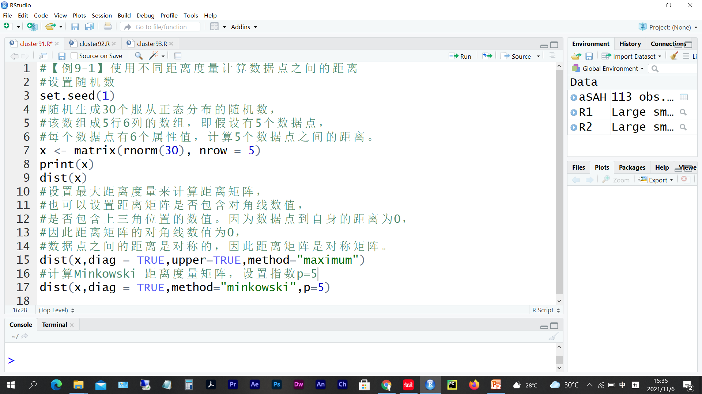
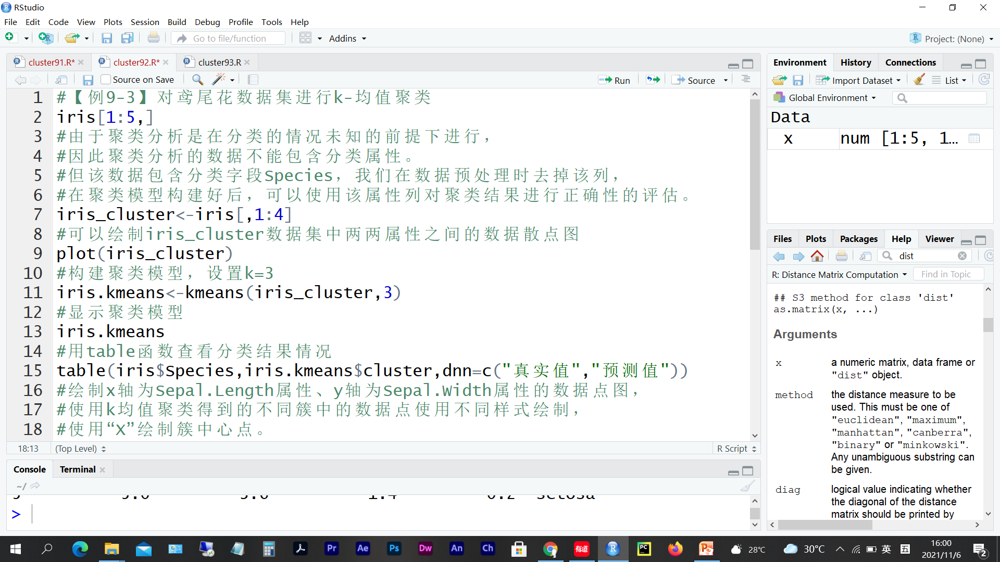
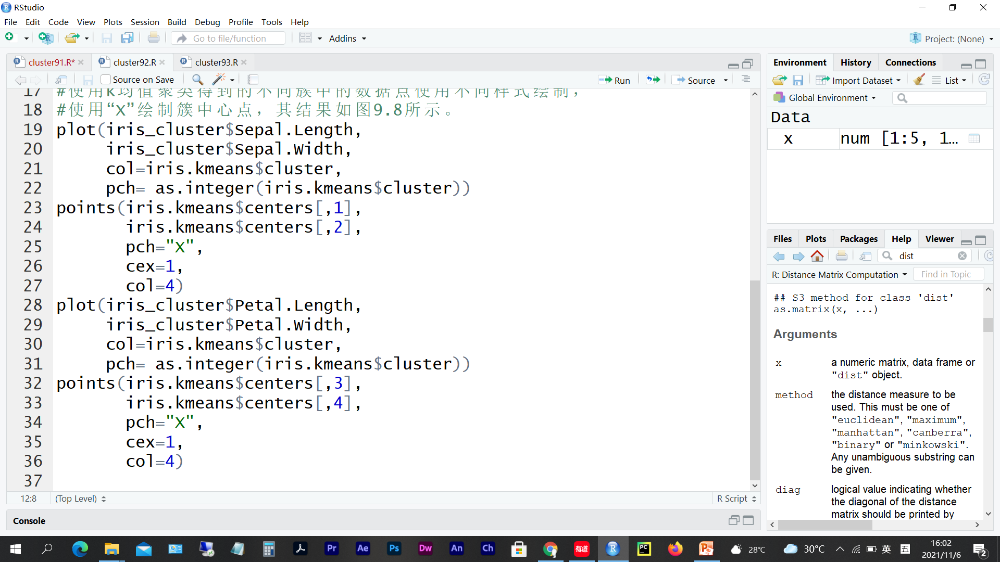
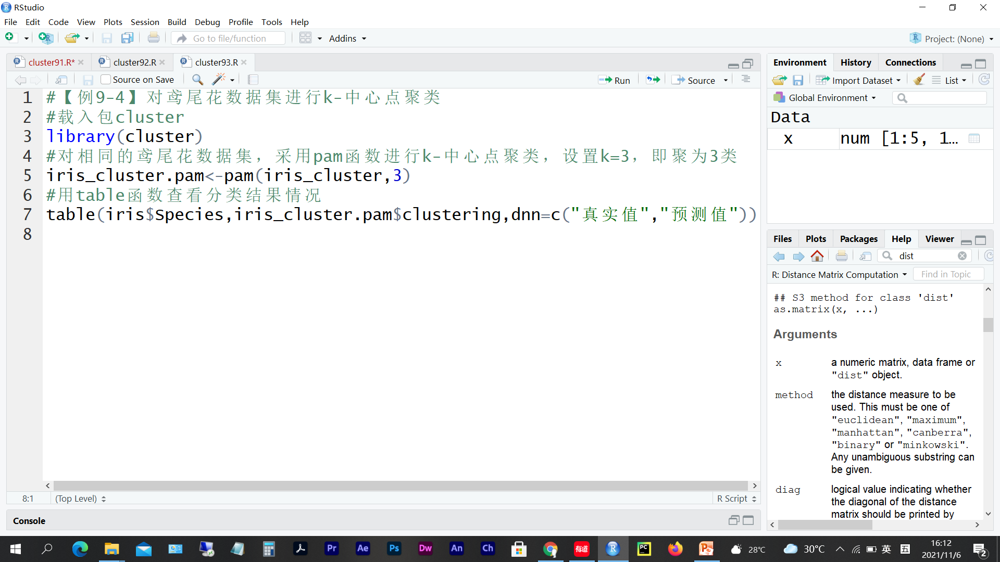
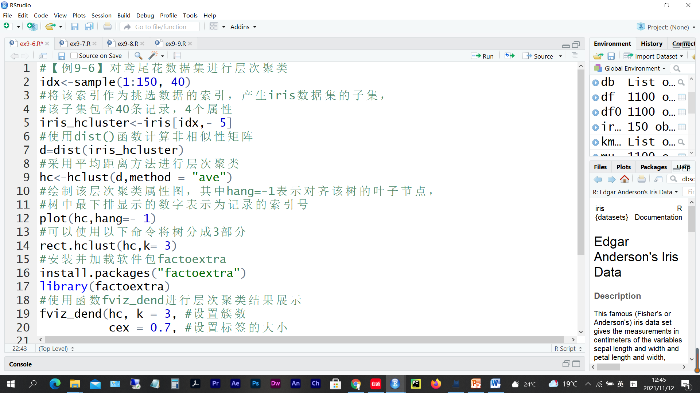
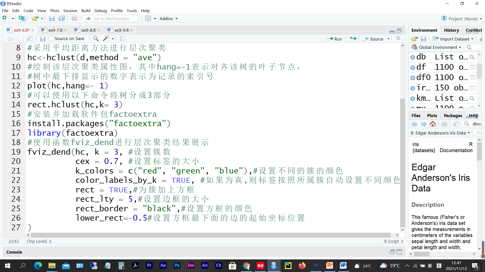
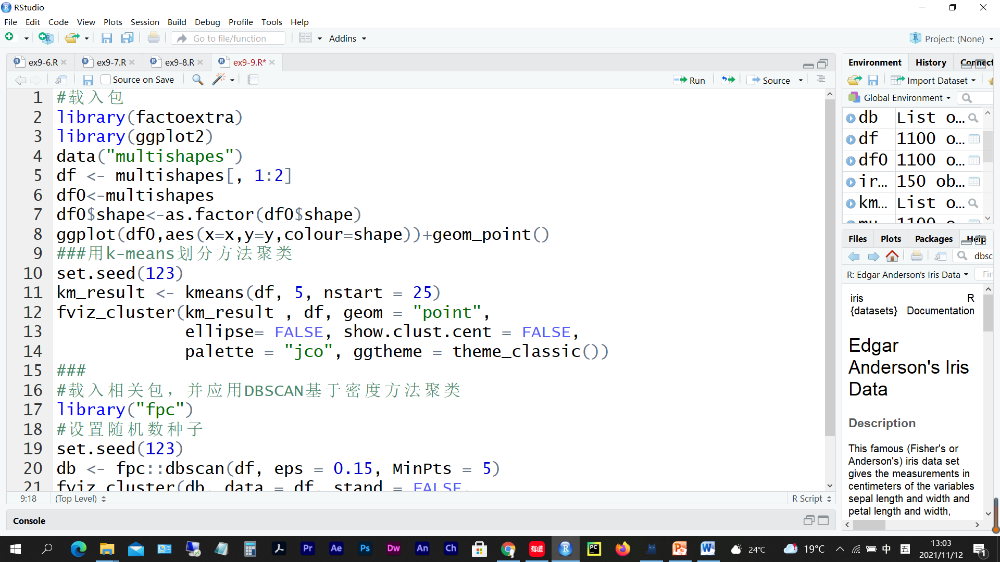
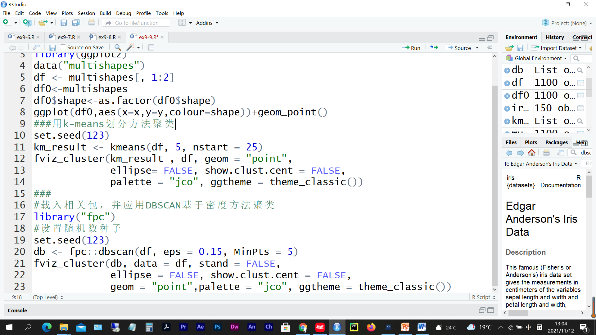
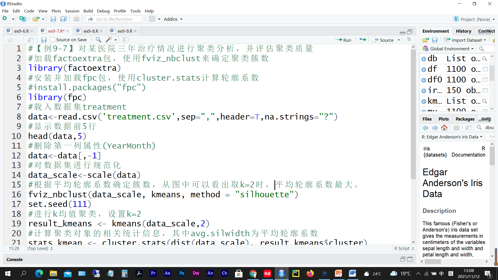
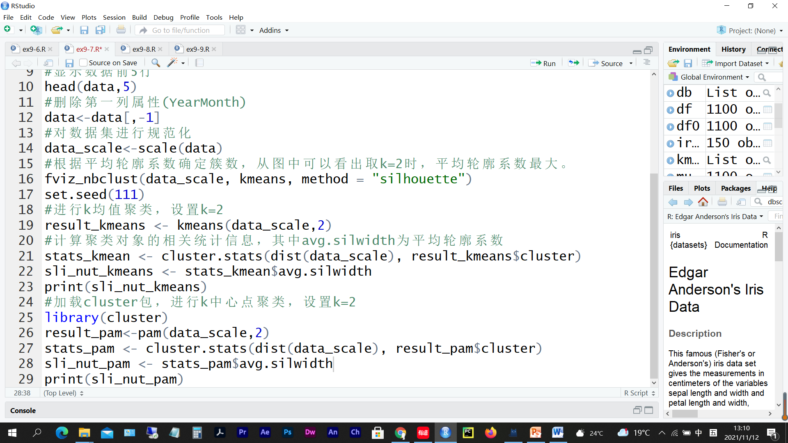

# 第 7 周　聚类

> 本文件由 `大数据实验7.pptx` 整理而成；
> 课件本身（.pptx）未收录进本仓库；文中的图片是幻灯片里原有的公式与数据表。

## 实验题 1　距离度量的使用

- 创建R脚本文件test0701.R，完成下面任务后把该脚本文件保存在e:/test07文件夹下。
  - 使用不同距离度量计算数据点之间的距离(参照本题代码完成）
    - (1)随机生成28个服从正态分布的随机数，该数组成4行7列的数组，计算4个数据点之间的距离。
    - (2)计算4个数据点之间的曼哈顿距离矩阵（包含对角线数值，包含上三角位置的数值）。
    - (3)计算4个数据点之间的闵可夫斯基距离矩阵，设置指数p=3（包含对角线数值，不包含上三角位置的数值）。

## 实验题 2　k-means(1)

- 创建R脚本文件test0702.R，完成下面任务后把该脚本文件保存在e:/test07文件夹下。
  - 对鸢尾花数据集进行k-均值聚类(参照本题代码完成）
    - (1)对鸢尾花数据集(去掉分类字段Species)，用kmeans函数聚类，设置k=3 。

## 实验题 3　k-中心点

- 创建R脚本文件test0703.R，完成下面任务后把该脚本文件保存在e:/test07文件夹下。
  - 对鸢尾花数据集进行k-中心点聚类(参照本题代码完成）
    - (1)安装并载入包cluster，对鸢尾花数据集(去掉分类字段Species)，用pam函数聚类，设置k=3 。

## 实验题 4　综合应用

- 创建R脚本文件test0704.R，完成下面任务后把该脚本文件保存在e:/test07文件夹下。
  - 分别用kmeans与k-中心点算法将8个数据点聚类为3个簇并绘出数据分布图及用“X”绘制簇中心点。数据点分别为：A1(2,10), A2(2,5), A3(8,4), A4(5,8), A5(7,5), A6(6,4), A7(1,2), A8(4,9)。

## 实验题 5　层次聚类

- 创建R脚本文件test0705.R，完成下面任务后把该脚本文件保存在e:/test07文件夹下。
  - 对iris数据集（删除分类属性列）进行层次聚类，为了清晰地显示聚类结果，我们随机挑选iris数据集中的40条记录进行聚类。

## 实验题 6　基于密度DBSCAN聚类

- 创建R脚本文件test0706.R，完成下面任务后把该脚本文件保存在e:/test07文件夹下。
  - 对multishapes数据集（删除分类属性列）分别用k-means方法和dbscan方法进行聚类，比较其聚类效果且说明原因。

## 实验题 7　聚类评估

- 创建R脚本文件test0707.R，完成下面任务后把该脚本文件保存在e:/test07文件夹下。
  - 对某医院三年治疗情况进行聚类分析，并评估聚类质量。其中医院治疗情况数据集treatment包含36条记录，10个属性列，即：年月、门诊人次（单位万）、出院人数、病床利用率、病床周转次数、平均住院天数、治疗好转率、病死率、诊断符合率、抢救成功率。

## 实验题 8　层次聚类应用

- 创建R脚本文件test0708.R，完成下面任务后把该脚本文件保存在e:/test07文件夹下。
  - 取出数据集iris的第3，4列，即属性Petal.Length与 Petal.Width，用k-means对其进行聚类（根据平均轮廓系数确定簇数），计算聚类对象的相关统计信息，并输出平均轮廓系数，并用fviz_cluster函数输出聚类图。
  - 用层次聚类算法对数据集iris的第3，4列进行聚类，并输出层次聚类图。

## 附录

- 这次需安装的依赖包较多（25个包，在目录packages下），不方便一个个安装，提供如下方法：
- 方法一：通过循环语句安装
- setwd(“e:/packages”)#设置包安装目录
- d1&lt;-list.files(&quot;e:/packages&quot;)
- for(i in 1:length(d1)) install.packages(d1[i],repos = NULL)
- 方法二：联网安装
- 打开网址：http://222.16.96.93/stulogin/
- 输入学号与初始密码即可联网在线安装
- 注意：提交作业时只需提交脚本文件（R文件），
- 包太多，不要将包压缩再提交。
