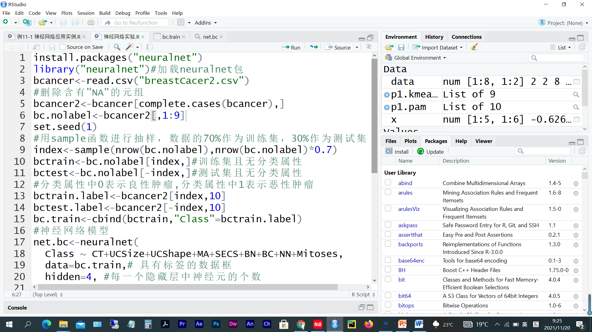
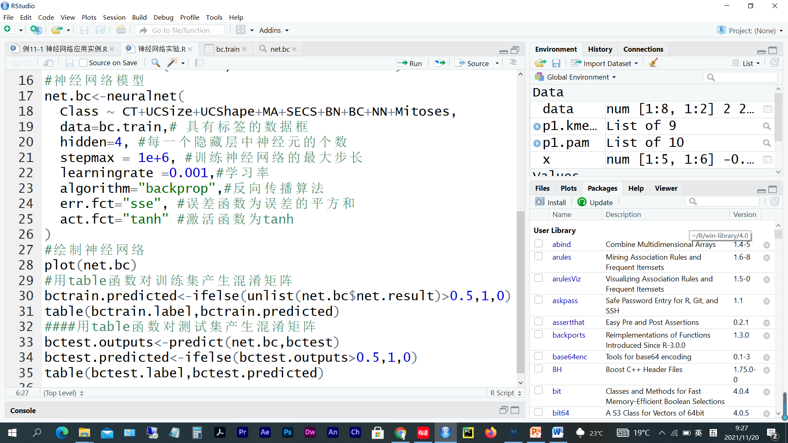
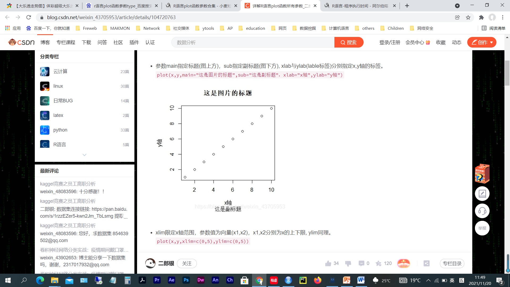
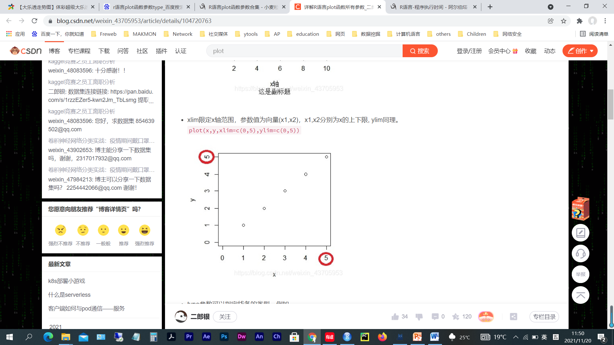
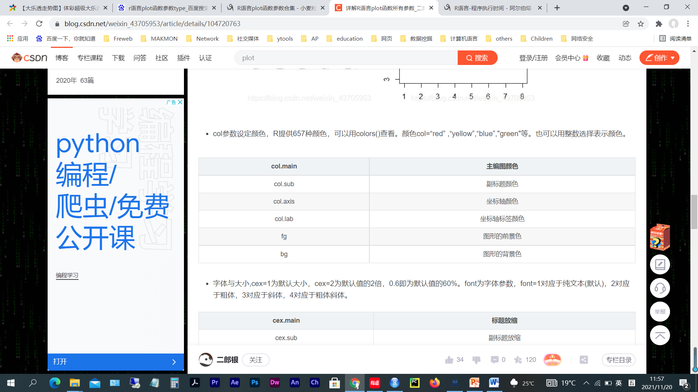

# 第 8 周　神经网络

> 本文件由 `大数据实验8.pptx`、`神经网络- 补充题目.pptx` 整理而成；
> 课件本身（.pptx）未收录进本仓库；文中的图片是幻灯片里原有的公式与数据表。

## 实验题 1

- 创建R脚本文件test0801.R，完成下面任务后把该脚本文件保存在e:/test08文件夹下。
  - 本例采用R语言中neuralnet神经网络包来对乳腺癌的数据进行一个分类操作，主要根据前面10个描述属性（去掉第1列的ID属性）用神经网络产生一个分类模型来判断每个样本是良性肿瘤（Benign Tumor）还是恶性肿瘤（Malignancy Tumor）。

## 实验题 2

- 创建R脚本文件test0802.R，完成下面任务后把该脚本文件保存在e:/test08文件夹下。
  - 为上例中程序增加求训练集与测试集混淆矩阵正确率并输出的代码。（上例程序31行与35行后，参照大数据分类实验中的相关代码）。

## 实验题 3

- 创建R脚本文件test0803.R，完成下面任务后把该脚本文件保存在e:/test08文件夹下。
  - 将上例中创建的神经网络模型中的参数中的算法改成“rprop+”、学习率分别改成0.1、0.05、0.01、0.005、0.001后计算其程序的运行时间并绘出其曲线（设置x轴标签为“学习率”，y轴为“时间”，设置plot函数中type类型为“o”，绘制点时使用的符号为16）。
  - 计算程序运行时间参考代码如下：
    - t1=proc.time()
    - #程序体
    - t2=proc.time()
    - t=t2-t1
    - print(paste0('执行时间：',t[3],'秒'))

## 实验题 4

- 创建R脚本文件test0804.R，完成下面任务后把该脚本文件保存在e:/test08文件夹下。
  - 将上例中创建的神经网络模型中的参数中的算法改成“rprop+”、学习率改成“0.01”、隐藏层神经元的个数分别改成2、3、4、5、6、7、8、9、10，然后重新执行一下上例代码，比较分析一下程序分类正确率的变化情况，并绘制两个图形。
    - 图1：训练集正确率的变化曲线(x轴标签：“神经元个数”，y轴标签：“训练集正确率”，设置plot函数中type类型为“o”，绘制点时使用的符号为16)
    - 图2：测试集正确率的变化曲线(x轴标签：“神经元个数”，y轴标签：“测试集正确率”，设置plot函数中type类型为“o”，绘制点时使用的符号为15)

## 附录：plot函数

## 附录：plot函数

## 附录：plot函数

## 附录：plot函数

## 附录：plot函数

## 附录：plot函数

## 附录：plot函数

## 附录：plot函数

## 附录：plot函数

## 附录：plot函数

## 神经网络  补充题目

- data.csv数据集包含21条记录，6个属性，x1-x5分别为培养基的总有机碳，总有机氮，磷酸盐，硫酸盐，氯化钠含量，out为菌体干重。试建立神经网络模型，实现对菌体干重的预测，并进行模型性能从R^2和RMSE两方面进行评价。如果性能不好，请进行模型参数调优。
